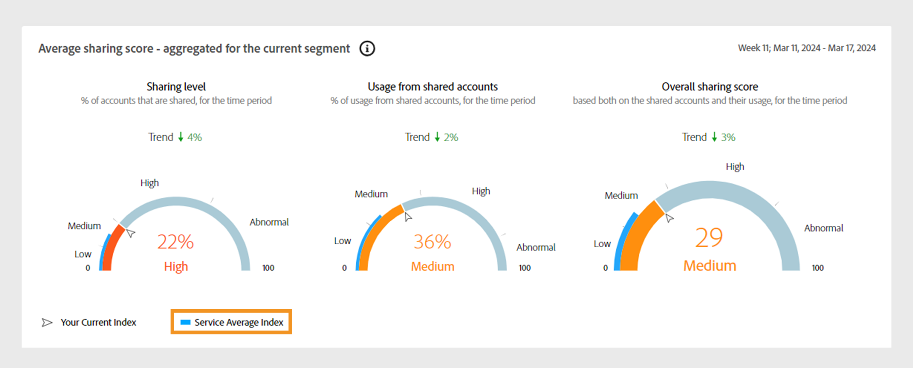

# Pannelli dati nel dashboard {#data-panels}

Dopo aver selezionato un segmento e un intervallo di tempo, il dashboard visualizza vari pannelli di dati, tabelle e grafici che riflettono una visualizzazione di alto livello dell’attività di condivisione all’interno del segmento selezionato.

La tabella seguente illustra la disponibilità e le differenze tra i pannelli dati in diverse [versioni](/help/accountiq/versions-aiq.md) di Account IQ:

| Pannelli dati | Servizi D2C | Programmatori TVE | MVPD TVE |
|---|---|---|---|
| [Punteggio medio di condivisione aggregato per il segmento corrente](#aggregated-sharing) | Disponibile e coerente | Disponibile e coerente | Disponibile e coerente |
| [Categorie video nel segmento](#video-categories-segment) | Disponibile con lievi varianti | Disponibile con lievi varianti | Disponibile con lievi varianti |
| [Condivisione del punteggio per canali e MVPD](#sharin-score-by-channels-and-mvpds) | Non disponibile | Disponibile | Non disponibile |
| [Probabilità di condivisione account](#accounts-sharing-probability) | Disponibile e coerente | Disponibile e coerente | Disponibile e coerente |
| [Numero di account e utilizzo condividendo il livello di probabilità](#number-of-accounts-usage-sharing-probability) | Disponibile e coerente | Disponibile e coerente | Disponibile e coerente |

## Punteggio medio di condivisione aggregato per il segmento corrente {#aggregated-sharing}

Il pannello punteggio medio di condivisione fornisce una lettura di prima linea che riepiloga la quantità e l’impatto della condivisione in termini di conti e volume di streaming.

Le metriche ti aiutano a comprendere l’entità (che varia da bassa, media, alta a anormale) della condivisione delle credenziali da parte degli abbonati, misurata in termini di account e consumo.

*Punteggio medio di condivisione aggregato per pannello per il segmento corrente*

>[!NOTE]
>
> L&#39;indicatore blu nel **punteggio medio di condivisione aggregato per il segmento corrente** ha scopi diversi per i servizi D2C rispetto a TV Everywhere. Per i servizi D2C, rappresenta l&#39;**Indice medio servizio** come mostrato nell&#39;immagine precedente. Se accedi come programmatore o MVPD, questa etichetta diventa **Indice medio settore**.

Le metriche seguenti sono componenti del pannello Punteggio di condivisione medio.

### Livello di condivisione {#sharing-level}

Il contatore dei livelli di condivisione mostra la percentuale di tutti gli account sottoscrittori condivisi all&#39;interno del segmento definito durante l&#39;intervallo di tempo selezionato.

La percentuale viene calcolata in base alla media della probabilità di condivisione calcolata per ogni conto nel segmento. Questo calcolo include account che sono stati inviati in streaming almeno una volta durante l&#39;intervallo di tempo selezionato.

L’indicatore Tendenza mostra la variazione percentuale nel valore della metrica rispetto all’intervallo di tempo precedente.

{width="350" align="left"}

*Livello di condivisione*

### Utilizzo da account condivisi {#usage-from-shared-accounts}

Il contatore indica la percentuale di utilizzo da parte dei conti condivisi tra tutti i conti sottoscrittori per il segmento e il periodo di tempo definiti. Questi intervalli, denominati Low, Medium, High e Abnormal, sono basati sulle medie del settore.

L’indicatore Tendenza, che mostra un aumento o una diminuzione nell’utilizzo da account condivisi rispetto all’intervallo di tempo precedente.

{width="350" align="left"}

*Utilizzo da account condivisi*

### Punteggio di condivisione complessivo {#overall-sharing-score}

Il punteggio di condivisione complessivo è una combinazione di punteggi di condivisione, tra cui &quot;Livello di condivisione&quot; e &quot;Utilizzo da account condivisi&quot;.

Fornisce un punteggio che riflette l’impatto complessivo della condivisione. Il suo scopo è simile a quello di un punteggio di credito, che riassume il livello di condivisione con un singolo numero. Ma in questo caso, un punteggio più alto indica un livello di condivisione maggiore.

{width="350" align="left"}

*Punteggio di condivisione complessivo*

## Categorie video nel segmento {#video-categories-segment}

Puoi selezionare le intestazioni di colonna per ordinare i dati in tutte le versioni di Account IQ.

Servizi +++D2C: Regioni nel segmento

Quando si effettua l&#39;accesso come servizio D2C, la tabella **Aree nel segmento** fornisce una visualizzazione comparativa dei diversi punteggi di condivisione aggregati per le [categorie video](/help/accountiq/product-concepts.md#video-category-def) nel segmento corrente.

*Punteggio di condivisione per aree nel segmento*

>[!NOTE]
>
> Le [categorie video](product-concepts.md#video-category-def) mostrate nell&#39;immagine precedente, ad esempio **Aree geografiche** nel segmento, sono solo un esempio. Quando accedi ad Account IQ, questo pannello mostra la categoria video specifica della tua azienda.

Seleziona **Esporta** per scaricare i dati in un file .csv. Scopri [come esportare i rapporti del pannello dati](/help/accountiq/export-reports.md).

+++

+++Programmatori: MVPD nel segmento

Quando si accede come programmatore, la tabella **MVPDs nel segmento** fornisce una visualizzazione comparativa dei diversi punteggi di condivisione aggregati per gli MVPD nel segmento corrente.

Seleziona **Esporta** per scaricare i dati in un file .csv. Scopri [come esportare i rapporti del pannello dati](/help/accountiq/export-reports.md).

+++

+++MVPDs: programmatori nel segmento

Quando si effettua l&#39;accesso come MVPD, la tabella **Programmatori nel segmento** fornisce una visualizzazione comparativa dei diversi punteggi di condivisione aggregati per i Programmatori nel segmento corrente.

Selezionare le intestazioni di colonna per ordinare i dati.

*Punteggio di condivisione per programmatori nel segmento*

Seleziona **Esporta** per scaricare i dati in un file .csv. Scopri [come esportare i rapporti del pannello dati](/help/accountiq/export-reports.md).

+++

## Condivisione del punteggio per canali e MVPD  {#sharin-score-by-channels-and-mvpds}

Quando si accede come programmatore, questa tabella fornisce una visualizzazione comparativa dei punteggi dei canali selezionati per gli MVPD nel segmento corrente.

Selezionare le intestazioni di colonna per ordinare i dati.

*Condivisione di punteggi per canali e MVPD*

## Probabilità di condivisione account {#accounts-sharing-probability}

Questo grafico suddivide i dati in intervalli di quintili di probabilità di condivisione, da molto basso (0-20%) a molto alto (80-100%). Ulteriori informazioni sugli intervalli di [probabilità di condivisione account](#accounts-sharing-probability).

>[!NOTE]
>
>Il grafico a barre utilizza una scala logaritmica.

*Numeri e percentuali di account sottoscrittori in intervalli di probabilità di condivisione diversi*

## Numero di account e utilizzo condividendo il livello di probabilità {#number-of-accounts-usage-sharing-probability}

Questo pannello fornisce una vista tabulare degli account suddivisi in intervalli di quintili di probabilità di condivisione, da molto basso (0-20%) a molto alto (80-100%), con l’utilizzo associato di ciascun quintile dagli account condivisi. Ulteriori informazioni sugli intervalli di [probabilità di condivisione account](#accounts-sharing-probability).

*Numero di account, tendenze e utilizzi che rientrano in diversi intervalli di probabilità*

Seleziona **Esporta** per scaricare i dati in un file .csv. Scopri [come esportare i rapporti del pannello dati](/help/accountiq/export-reports.md).
