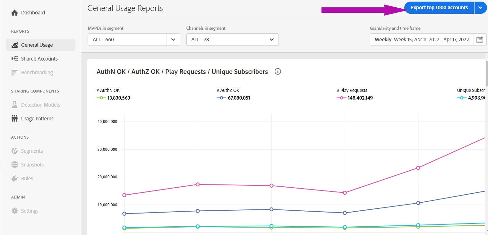
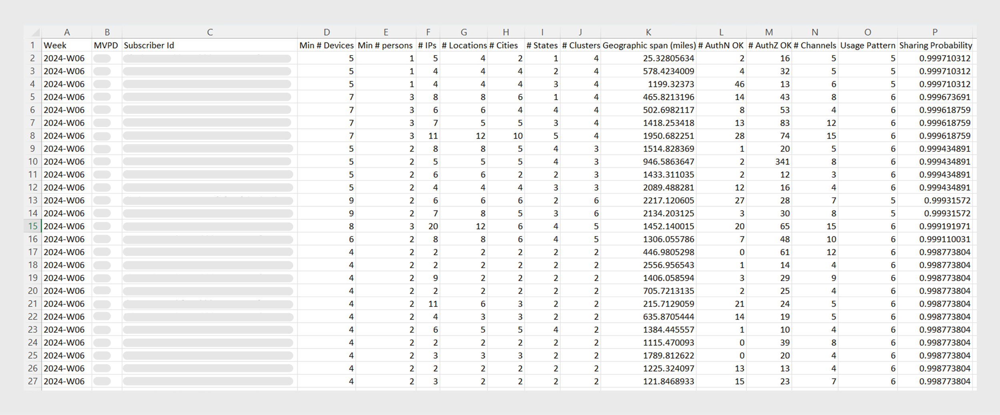

# Esporta informazioni per account con punteggio di condivisione elevato {#export-account-info-high-score}

[!UICONTROL Account IQ] consente di esportare i dettagli di condivisione dell’account per i primi 1000 account abbonati in base ai [condivisione delle probabilità](/help/accountiq/product-concepts.md#account-sharing-probability-def). I dati nel file CSV esportato vengono ordinati in base all&#39;ordine decrescente delle probabilità di condivisione degli account sottoscrittori, degli MVPD selezionati nell&#39; [segmento](/help/accountiq/product-concepts.md#segment-def), per un [intervallo di tempo specificato](/help/accountiq/product-concepts.md#time-frame-def).

L’opzione per esportare le informazioni di condivisione dell’account è disponibile su [Rapporti di utilizzo generali](/help/accountiq/general-usage-reports.md) e [Rapporti sugli account condivisi](/help/accountiq/shared-acc-reports.md) pagine.

>[!NOTE]
>
>I numeri nel file CSV scaricato sono diversi per le pagine dei rapporti Utilizzo generale e Account condivisi. Questo perché la pagina dei report sull’utilizzo generale dispone di filtri aggiuntivi che consentono ai programmatori di selezionare la soglia per il numero di dispositivi, IP e codici postali. Pertanto, i dati esportati dai report di utilizzo generale si basano sul filtro di soglia aggiuntivo applicato.

Per esportare le informazioni sulla condivisione dell&#39;account degli abbonati:

1. Definisci un segmento desiderato seguendo i passaggi descritti in [Come definire il segmento e selezionare l’intervallo temporale](/help/accountiq/howto-select-segment-timeframe.md) per la valutazione da [segmento e arco temporale](/help/accountiq/segments-timeframe.md) pannello.

1. Seleziona la **[!UICONTROL Export top 1000 accounts]** opzione per esportare le informazioni sull’account per 1000 abbonati con la maggiore probabilità di condivisione.

Quando si utilizza l&#39;opzione di esportazione, le statistiche relative a 1000 account con le maggiori probabilità di condivisione (per un intervallo di tempo definito) vengono scaricate nella cartella Download del computer locale.

>[!NOTE]
>
>Il file CSV scaricato può essere aperto utilizzando qualsiasi applicazione che legge il file CSV, ad esempio Microsoft Excel.

*Figura: Dati dell’account condiviso esportato in formato CSV*

## Colonne nel report esportato {#columns-in-export}

**Settimana/Mese**

La settimana o il mese selezionato il **[!UICONTROL Granularity and Time Frame]** nel selettore di segmenti, per il quale vengono richieste le statistiche di condivisione.

**MVPD**

Se sei un utente programmatore, la colonna mostra a quale MVPD appartiene l’account abbonato.

**ID abbonato**

Account specifico di cui stiamo parlando in una fila.

**Numero minimo di dispositivi**

Il numero effettivo di dispositivi (tale contenuto in streaming) è quasi certamente superiore al numero minimo di dispositivi specificato per un account specifico.

>[!NOTE]
>
>Il numero effettivo di dispositivi (contenuti in streaming) è sicuramente maggiore del numero minimo di dispositivi specificato per un account specifico.

**Numero minimo di persone**

Il numero minimo assoluto di persone che erano contenuti in streaming attivi utilizzando tali dispositivi.

>[!NOTE]
>
>Il numero effettivo di persone (contenuto in streaming) è quasi certamente molto maggiore del numero minimo di persone, specificato per un account specifico.

**[!UICONTROL # IPs]**

Numero di indirizzi IP da cui il contenuto viene inviato in streaming.

**[!UICONTROL # Locations]**

Numero di posizioni (in base al codice postale) da cui il contenuto viene inviato in streaming.

**[!UICONTROL # Cities]**

Numero di città in cui ha avuto luogo lo streaming.

**[!UICONTROL # States]**

Numero di stati in cui ha avuto luogo lo streaming.

**[!UICONTROL # Clusters]**

Numero di elementi distinti [cluster](/help/accountiq/product-concepts.md#cluster-def) dove ha avuto luogo lo streaming.

**[!UICONTROL Geographic span (miles)]**

La distanza massima tra le posizioni di streaming associate all’account.

**[!UICONTROL # AuthN OK]**

Il numero di volte in cui gli utenti hanno effettuato l’accesso durante il periodo, utilizzando tale account.

**[!UICONTROL # AuthZ OK]**

Numero di volte in cui un MVPD ha autorizzato un flusso o concesso l’accesso (ai contenuti) a tale account.

>[!NOTE]
>
>Il **[!UICONTROL # AuthZ OK]** è correlato al **[!UICONTROL # Play Requests]**; è più piccolo del **[!UICONTROL # Play Requests]** perché Adobe memorizza in cache le autorizzazioni fornite per gli MVPD in genere per 24 ore.

**[!UICONTROL # Play Requests]**

Il numero effettivo di flussi durante il periodo di tempo.

**[!UICONTROL # Channels]**

Numero totale di canali diversi guardati dall’account nel periodo di tempo.

>[!NOTE]
>
>**[!UICONTROL # Channels]** include i canali che non appartengono necessariamente al programmatore connesso.
>
>Questo numero per l’account viene visualizzato perché l’account ha guardato il tuo canale, ma ha anche effettuato l’accesso ad altri canali durante tale periodo di tempo.

**Pattern di utilizzo**

I numeri in questa colonna sono identificatori che corrispondono a uno dei 14 pattern con cui identifichiamo tutti gli account utente.

*Tabella: Identificatori del pattern di utilizzo nella mappatura CSV esportata con pattern di utilizzo*

| ID | 1 | 2 | 3 | 4 | 5 e 8 | 6 | 7 | 9 | 10 e 11 | 12 | 13 | 14 |
|---|---|---|---|---|---|---|---|---|---|---|---|---|
| Modelli di utilizzo | Utente normale | Viaggiatore o pendolare | Famiglia numerosa | Famiglia e amici intimi | Condivisione gruppo social network | Grande gruppo di amici | Streaming simultaneo | Condivisione community | Comportamento incerto | Famiglia piccola | Seconda pagina principale | Utilizzo anormale |

{style="table-layout:auto"}

**Probabilità di condivisione**

La probabilità di condivisione è la probabilità che l’account specifico condivida le proprie credenziali.

>[!NOTE]
>
> La media della probabilità di condivisione di tutti i conti (nel segmento selezionato) viene utilizzata per calcolare la [livello di condivisione](/help/accountiq/dashboard.md#sharing-level) del [Punteggio di condivisione aggregato](/help/accountiq/dashboard.md#aggregated-sharing).
