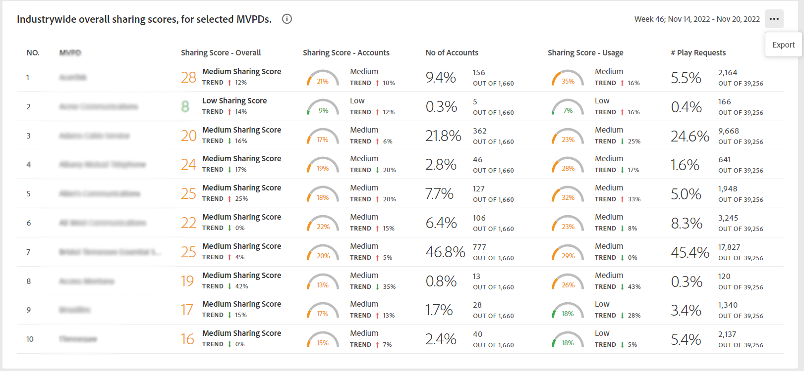
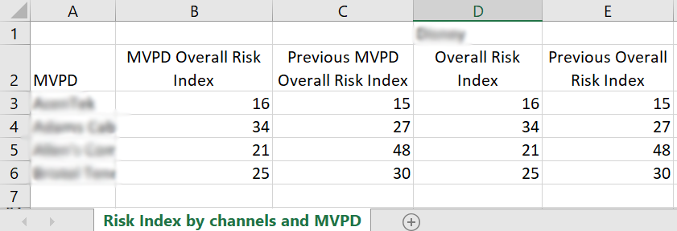

# Esportare metriche per un programmatore e MVPD selezionati in un segmento {#export-metric}

Dashboard in [!UICONTROL Account IQ] visualizza tabelle e grafici per le statistiche di condivisione delle credenziali degli account sottoscrittore nel segmento selezionato. Oltre a visualizzare i pattern e i punteggi di condivisione, da queste tabelle puoi anche esportare le metriche di utilizzo dell’account e i punteggi di condivisione per gli abbonati degli MVPD e dei canali nel segmento selezionato.

Per esportare le metriche per programmatori specifici e MVPD selezionati nel segmento, una volta effettuato l’accesso come utente programmatore autorizzato:

1. Definisci un segmento desiderato seguendo i passaggi descritti in [Come definire il segmento e selezionare l’intervallo temporale](/help/accountiq/howto-select-segment-timeframe.md) per la valutazione da [segmento e arco temporale](/help/accountiq/segments-timeframe.md) pannello.

1. Passare a uno dei pannelli seguenti:

   * [!UICONTROL Industrywide overall sharing scores, for selected MVPDs]
     

   * [!UICONTROL Sharing Score by channels and MVPDs]

     

   * [!UICONTROL Number of accounts and usage by sharing probability level]

     

1. Seleziona **[!UICONTROL Export]** disponibile nell’angolo superiore destro del pannello.

I dati vengono esportati in formato CSV e il file viene scaricato localmente sul dispositivo. Puoi utilizzare il visualizzatore CSV e l’editor desiderati per aprire i rapporti esportati.

* Punteggi di condivisione a livello di settore per MVPD selezionati

  

* Condivisione del punteggio per canali e MVPD nel segmento

  

* Numero di account e utilizzo condividendo il livello di probabilità

  
