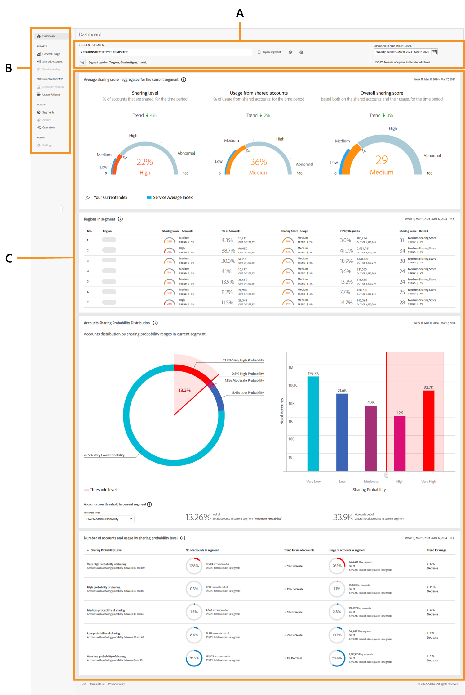

# Introduzione alla dashboard {#introduction-dashboard}

La dashboard riepiloga e aggrega i dati in una raccolta di grafici e rapporti progettati per fornire una panoramica di alto livello dell’ambito e dell’impatto della condivisione degli account. Fornisce una singola pagina contenente i report e le metriche principali di [!UICONTROL Account IQ].

>[!NOTE]
>
>La maggior parte dei pannelli dati nei servizi D2C, nei programmatori e nei dashboard MVPD sono identici. Tuttavia, alcuni pannelli dati possono differire per ciascuna versione.

Servizi +++D2C: dashboard

{align="left"}

*Dashboard per servizi D2C*

**A.** Segmento e pannello intervallo di tempo **B.** Navigazione pagine **C.** Pannelli dati

+++

+++Programmatori: Cruscotto

{align="left"}

*Dashboard per programmatori*

**A.** Segmento e pannello intervallo di tempo **B.** Navigazione pagine **C.** Pannelli dati

+++

+++MVPDs: Dashboard

Il cruscotto degli MVPD è leggermente diverso da quello dei programmatori.

![dashboard di [!UICONTROL Account IQ] per MVPDs](assets/dashboard-mvpd.png){align="left"}

*Dashboard per MVPD*

**A.** Segmento e pannello intervallo di tempo **B.** Navigazione pagine **C.** Pannelli dati

+++

Il dashboard per servizi D2C, programmatori e MVPD include:

* **Segmenti e pannello intervallo di tempo**: questo pannello consente di selezionare segmenti e intervalli di tempo per generare rapporti di condivisione account e fornire un riepilogo del segmento selezionato. Visualizza [segmenti e intervallo di tempo](/help/accountiq/segments-timeinterval.md) per ulteriori informazioni.

* **Navigazione pagine**: queste schede ti consentono di navigare ed esplorare varie sezioni e pagine di Account IQ.

* **Pannelli dati**: i pannelli visualizzano i rapporti di condivisione dell&#39;account tramite tabelle e grafici, offrendo la possibilità di esportarli come rapporti direttamente sul dispositivo locale. Visualizza [pannelli dati](/help/accountiq/data-panels.md) e [esporta rapporti pannello dati](/help/accountiq/export-reports.md) per ulteriori informazioni.
