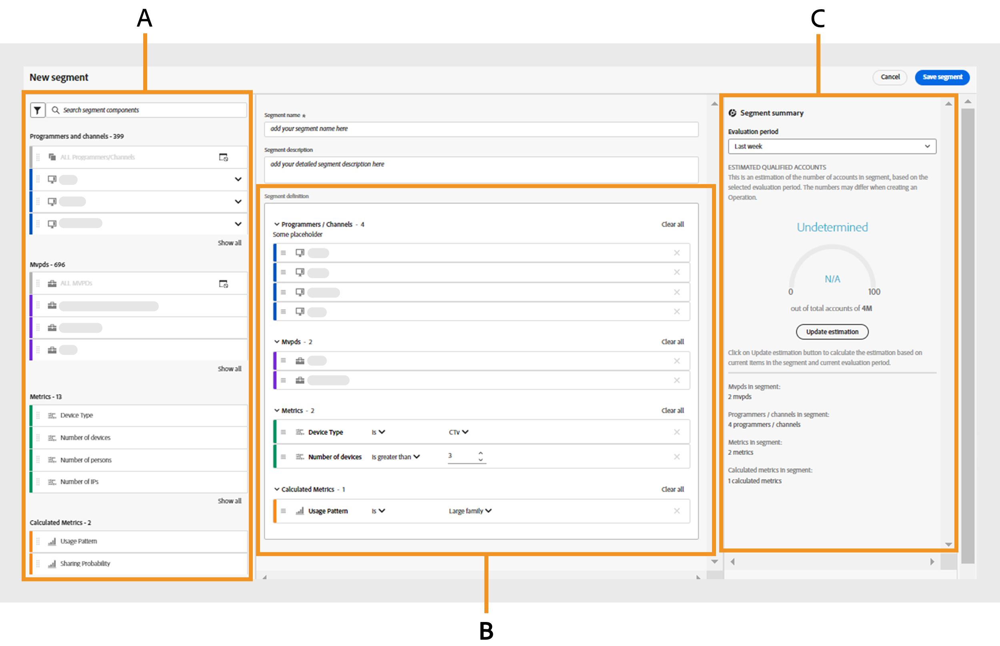

# Utilizzare i segmenti {#work-with-segments}

[I segmenti](product-concepts.md#segmet-def) sono una raccolta di account sottoscrittori che ti consentono di analizzare la condivisione delle credenziali in condizioni definite dall&#39;utente. È possibile utilizzare i segmenti per esaminare diversi set di account sottoscrittore e generare report di dati corrispondenti in tabelle e grafici. In Account IQ sono disponibili due tipi di segmenti:

1. **Segmento predefinito**: **Tutti gli account nelle proprietà** sono un segmento predefinito nel sistema che include tutti gli account sottoscrittore attivi senza condizioni specifiche applicate.

   >[!NOTE]
   >
   >L&#39;utilizzo del segmento predefinito può impedire la visualizzazione di determinate tabelle come [Categorie video nel segmento](data-panels.md#video-categories-segment), [Condivisione del punteggio per canali e MVPD](data-panels.md#sharin-score-by-channels-and-mvpds) e [Distribuzione del pattern di utilizzo per categorie video](usage-patterns.md#usage-pattern-dis-video-categories). Queste tabelle possono contenere e visualizzare solo dati per un massimo di 20 righe alla volta. Le tabelle, i grafici e i rapporti rimanenti sono gli stessi per i segmenti predefiniti e personalizzati.

1. **Segmenti personalizzati**: si tratta di segmenti personalizzati che consentono di raggruppare gli account degli abbonati da categorie specifiche, ad esempio tipi di contenuto D2C, programmatori, canali e MVPD per l&#39;analisi della condivisione delle credenziali in condizioni definite dall&#39;utente. Ulteriori informazioni su come [creare un segmento personalizzato](#create-new-segment).

   >[!IMPORTANT]
   >
   >Tutte le procedure descritte in questa guida si basano su segmenti personalizzati. Tuttavia, i concetti restano gli stessi per i segmenti predefiniti e personalizzati.

Quando si passa a **Azioni** e si seleziona la scheda **[!UICONTROL Segments]** nel pannello a sinistra, viene visualizzato un elenco dei segmenti disponibili nel sistema. La pagina dei segmenti consente di valutare rapidamente i dettagli chiave di ciascun segmento in formato tabulare. I dettagli includono il nome del segmento, il numero di [categorie video](product-concepts.md#video-category-def), metriche, [operazioni](product-concepts.md#operation-def) utilizzando il segmento corrente, la data e l&#39;ora dell&#39;ultima modifica, nonché il nome dell&#39;autore del segmento.

Con i segmenti puoi eseguire le seguenti funzioni:

* [Crea un nuovo segmento](#create-new-segment)
* [Gestire i segmenti](#manage-segments)

## Crea un nuovo segmento {#create-new-segment}

Il processo di creazione di un nuovo segmento è simile per i servizi D2C e TV Everywhere. Le categorie video saranno diverse per ogni rispettiva versione di Account IQ.

+++Servizi D2C

Per creare un segmento e analizzare il comportamento di condivisione del sottoscrittore, selezionare **[!UICONTROL Create new segment]** in alto a destra.

*Seleziona Crea nuovo segmento*

>[!NOTE]
>
>Le categorie video mostrate nell&#39;immagine precedente, ad esempio **Aree geografiche** e **Tipi di contenuto**, sono solo esempi. Quando accedi ad Account IQ, queste etichette visualizzano le categorie video specifiche della tua azienda.

Viene aperta una pagina **Nuovo segmento**, che include i seguenti elementi:

*Pagina nuovo segmento*

**A.** Componenti segmento **B.** Definizione segmento **C.** Riepilogo segmento

* **Componenti del segmento**: inventario di [categorie video](product-concepts.md##video-category-def) e metriche calcolate utilizzate per definire un segmento.

  >[!NOTE]
  >
  >Utilizza **[!UICONTROL Show all]** per espandere l&#39;elenco dei componenti del segmento. Per trovare rapidamente un componente, cercare il nome in **componenti del segmento di ricerca** anziché scorrere l&#39;intero elenco.

* **Definizione del segmento**: area di lavoro in cui è possibile trascinare e rilasciare vari componenti del segmento per creare un segmento.

* **Riepilogo segmento**: riepilogo che valuta i conti qualificati in base ai componenti nella definizione del segmento e fornisce una breve panoramica del segmento durante il periodo di valutazione.

Per creare un segmento, effettua le seguenti operazioni:

1. Digita il nome del segmento in **Nome segmento** che sarà visibile nell&#39;elenco dei segmenti e durante la selezione del segmento.
1. Digita una descrizione dettagliata del segmento in **Descrizione segmento**.
1. Ad esempio, trascina **Aree geografiche e tipi di contenuto** dai componenti del segmento nel pannello a sinistra e rilasciali nella sezione **Aree geografiche/Tipi di contenuto** all&#39;interno della **Definizione segmento**.

   >[!NOTE]
   >
   >Puoi creare un segmento in base alle aree geografiche o ai tipi di contenuto. Visualizza i tipi di contenuto associati di un&#39;area da un menu a discesa.

   Se si inizia aggiungendo un tipo di contenuto **tipo di contenuto** nella sezione **Aree geografiche/Tipi di contenuto**, è possibile aggiungere solo i tipi di contenuto come componenti successivi.

   Se si inizia aggiungendo una **Area** nella sezione **Aree geografiche/Tipi di contenuto**, verrà visualizzata una finestra di dialogo di decisione.

   {width="550" align="left"}

   *Aggiungi componente segmento come area geografica o finestra di dialogo dei tipi di contenuto*

   Decidi se confrontare aree specifiche o un segmento in base ai tipi di contenuto associati a un’area.

   Selezionare **[!UICONTROL As a region]** per aggiungere aree alla sezione **Aree geografiche/Tipi di contenuto**.

   Selezionare **[!UICONTROL As its content types]** per aggiungere tipi di contenuto di un&#39;area.

1. Trascina **Metriche** dai componenti del segmento nel pannello di sinistra e rilasciali nella sezione **Metriche** all&#39;interno della **Definizione del segmento**.

   

   *Selezionare un operatore e assegnare un valore per la metrica aggiunta*

   Dopo aver aggiunto le metriche nella definizione del segmento, scegli un operatore dal menu a discesa **[!UICONTROL Select an operator]** e assegna un valore utilizzando **[!UICONTROL Select an option]**.

   Regola i valori per alcune metriche utilizzando la freccia verso l&#39;alto per aumentare e la freccia verso il basso per diminuire.

1. Trascina **Metriche calcolate** dai componenti del segmento nel pannello di sinistra e rilasciali nella sezione **Metriche calcolate** all&#39;interno della **Definizione segmento**.

   

   *Selezionare un operatore e assegnare un valore per la metrica calcolata aggiunta*

   Dopo aver aggiunto le metriche calcolate nella definizione del segmento, **[!UICONTROL Select an operator]** dal menu a discesa e assegna un valore utilizzando **[!UICONTROL Select an option]**.

   >[!NOTE]
   >
   >Tutte le metriche e le metriche calcolate rilasciate nella definizione del segmento sono accompagnate da operatori appropriati per assegnare valori alle rispettive metriche e metriche calcolate.

1. Rivedi i dettagli del segmento nel **Riepilogo segmento** per decidere le modifiche da implementare nel segmento.
1. Selezionare **[!UICONTROL Last week]** o **[!UICONTROL Last month]** dal menu a discesa **Periodo di valutazione** per stimare i valori di riepilogo per la settimana o il mese trascorso.
1. Selezionare **[!UICONTROL Update estimation]** per calcolare il numero di conti qualificati stimati nel segmento corrente in base al periodo di valutazione selezionato.
1. Selezionare **[!UICONTROL Save segment]**.

Il segmento creato è ora disponibile nell’elenco dei segmenti.

+++

+++TV Ovunque

Per creare un segmento e analizzare il comportamento di condivisione del sottoscrittore, selezionare **[!UICONTROL Create new segment]** in alto a destra.

*Seleziona Crea nuovo segmento*

Viene aperta una pagina **Nuovo segmento**, che include i seguenti elementi:

*Pagina nuovo segmento*

**A.** Componenti segmento **B.** Definizione segmento **C.** Riepilogo segmento

* **Componenti del segmento**: inventario di programmatori e canali, MVPD, metriche e metriche calcolate utilizzati per definire un segmento.

  >[!NOTE]
  >
  >Utilizza **[!UICONTROL Show all]** per espandere l&#39;elenco dei componenti del segmento. Per trovare rapidamente un componente, cercare il nome in **componenti del segmento di ricerca** anziché scorrere l&#39;intero elenco.

* **Definizione del segmento**: area di lavoro in cui è possibile trascinare e rilasciare vari componenti del segmento per creare un segmento.

* **Riepilogo segmento**: riepilogo che valuta i conti qualificati in base ai componenti nella definizione del segmento e fornisce una breve panoramica del segmento durante il periodo di valutazione.

Per creare un segmento, effettua le seguenti operazioni:

1. Digita il nome del segmento in **Nome segmento** che sarà visibile nell&#39;elenco dei segmenti e durante la selezione del segmento.
1. Digita una descrizione dettagliata del segmento in **Descrizione segmento**.
1. Trascina **Programmatori e canali** dai componenti del segmento nel pannello di sinistra e rilasciali nella sezione **Programmatori/canali** all&#39;interno della **Definizione del segmento**.

   >[!NOTE]
   >
   >Puoi creare un segmento basato su programmatori o canali. Visualizza i canali associati con un programmatore da un menu a discesa.

   Se inizi aggiungendo un **Canale** nella sezione **Programmatori/Canali**, puoi aggiungere solo canali come componenti successivi.

   Se si inizia aggiungendo un **Programmatore** nella sezione **Programmatori/Canali**, verrà visualizzata una finestra di dialogo di decisione.

   {width="550" align="left"}

   *Aggiungi componente segmento come programmatore o finestra di dialogo dei suoi canali*

   Decidi se confrontare programmatori specifici o un segmento in base ai canali associati a un programmatore.

   Selezionare **[!UICONTROL As a programmer]** per aggiungere programmatori alla sezione **Programmatori/canali**.

   Selezionare **[!UICONTROL As its channels]** per aggiungere tutti i canali di un programmatore.

1. Trascina **MVPDs** dai componenti del segmento nel pannello di sinistra e rilasciali nella sezione **MVPDs** all&#39;interno della **definizione del segmento**.

   >[!NOTE]
   >
   >Quando accedi come programmatore, un MVPD denominato **xfinity** viene visualizzato come opzione autonoma nella sezione **MVPDs**. Non è possibile combinarlo con altri MVPD.

1. Trascina **Metriche** dai componenti del segmento nel pannello di sinistra e rilasciali nella sezione **Metriche** all&#39;interno della **Definizione del segmento**.

   

   *Selezionare un operatore e assegnare un valore per la metrica aggiunta*

   Dopo aver aggiunto le metriche nella definizione del segmento, scegli un operatore dal menu a discesa **[!UICONTROL Select an operator]** e assegna un valore utilizzando **[!UICONTROL Select an option]**.

   Regola i valori per alcune metriche utilizzando la freccia verso l&#39;alto per aumentare e la freccia verso il basso per diminuire.

1. Trascina **Metriche calcolate** dai componenti del segmento nel pannello di sinistra e rilasciali nella sezione **Metriche calcolate** all&#39;interno della **Definizione segmento**.

   

   *Selezionare un operatore e assegnare un valore per la metrica calcolata aggiunta*

   Dopo aver aggiunto le metriche calcolate nella definizione del segmento, **[!UICONTROL Select an operator]** dal menu a discesa e assegna un valore utilizzando **[!UICONTROL Select an option]**.

   >[!NOTE]
   >
   >Tutte le metriche e le metriche calcolate rilasciate nella definizione del segmento sono accompagnate da operatori appropriati per assegnare valori alle rispettive metriche e metriche calcolate.

1. Rivedi i dettagli del segmento nel **Riepilogo segmento** per decidere le modifiche da implementare nel segmento.
1. Selezionare **[!UICONTROL Last week]** o **[!UICONTROL Last month]** dal menu a discesa **Periodo di valutazione** per stimare i valori di riepilogo per la settimana o il mese trascorso.
1. Selezionare **[!UICONTROL Update estimation]** per calcolare il numero di conti qualificati stimati nel segmento corrente in base al periodo di valutazione selezionato.
1. Selezionare **[!UICONTROL Save segment]**.

Il segmento creato è ora disponibile nell’elenco dei segmenti.
+++

## Gestire i segmenti {#manage-segments}

Puoi selezionare un segmento dall’elenco dei segmenti ed eseguire le azioni seguenti:

* [Modificare un segmento](#edit-segment)
* [Duplicare un segmento](#duplicate-segment)
* [Eliminare un segmento](#delete-segment)

*Selezionare un segmento da modificare, duplicare o eliminare*

**A.** [Segmento predefinito](#work-with-segments) **B.** [Categorie video](product-concepts.md#video-category-def)

>[!NOTE]
>
>Le categorie video mostrate in questa sezione, ad esempio **MVPDs**, **Programmer** e **Canali**, rappresentano le etichette utilizzate nella versione TV Everywhere di Account IQ. Se hai effettuato l’accesso come servizio D2C, queste etichette visualizzano le categorie video specifiche della tua azienda.

Impossibile modificare, duplicare o eliminare il segmento predefinito denominato **Tutti gli account nelle proprietà**.

### Modificare un segmento {#edit-segment}

1. Passa alla scheda **[!UICONTROL Segments]** in **Azioni** nel pannello a sinistra per visualizzare un elenco di segmenti.
1. Seleziona un segmento da modificare.
1. Selezionare **[!UICONTROL Edit]**.
1. Modificare i dettagli del segmento, ad esempio il nome del segmento, la descrizione o i componenti nella **definizione del segmento**.

   >[!TIP]
   >
   >Utilizza **[!UICONTROL Clear all]** per rimuovere contemporaneamente tutti i componenti del segmento all&#39;interno di ogni sezione nella definizione del segmento. In alternativa, selezionate il pulsante croce per rimuovere singoli elementi.

   

   *Seleziona Cancella tutto per rimuovere tutti i componenti di segmento contemporaneamente*

1. Selezionare **[!UICONTROL Update segment]** per aggiornare il segmento esistente o **[!UICONTROL Save as new segment]** per creare un nuovo segmento con le modifiche.

   >[!NOTE]
   >
   >Non è consentito aggiornare segmenti attualmente in fase di operazioni. Il salvataggio delle modifiche come nuovo segmento è l’unica opzione per i segmenti con operazioni in corso.

### Duplicare un segmento {#duplicate-segment}

1. Passa alla scheda **[!UICONTROL Segments]** in **Azioni** nel pannello a sinistra per visualizzare un elenco di segmenti.
1. Seleziona un segmento da duplicare.
1. Selezionare **[!UICONTROL Duplicate]**.

Una copia del segmento selezionato viene generata e posizionata alla fine dell’elenco dei segmenti. Puoi modificare i dettagli necessari nel segmento duplicato e quindi aggiornare il segmento duplicato o salvarlo come nuovo segmento.

### Eliminare un segmento {#delete-segment}

1. Passa alla scheda **[!UICONTROL Segments]** in **Azioni** nel pannello a sinistra per visualizzare un elenco di segmenti.
1. Seleziona un segmento da rimuovere.

   Seleziona più segmenti per eliminarli in una singola operazione. È inoltre possibile selezionare una casella di controllo a sinistra di **Nome segmento** per eliminare tutti i segmenti contemporaneamente.

   >[!NOTE]
   >
   > Puoi eliminare più di un segmento o tutti i segmenti solo se nessuno di essi è utilizzato dalle operazioni. Inoltre, non è consentito eliminare il segmento predefinito denominato **Tutti gli account nelle proprietà**. Quando tenti di eliminare tutti i segmenti contemporaneamente, l’opzione non viene selezionata.

   

   *Selezionare più segmenti per eliminare più segmenti*

1. Selezionare **[!UICONTROL Delete]**.
1. Conferma su **[!UICONTROL Delete]** nella finestra di dialogo per rimuovere definitivamente il segmento.

   >[!NOTE]
   >
   >Il segmento viene eliminato definitivamente dal sistema e non puoi annullare questa azione.
