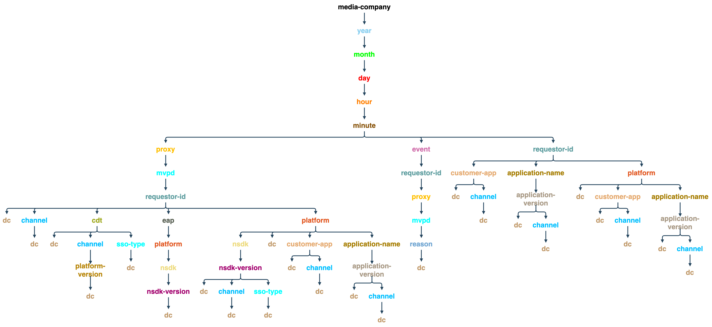

# API di monitoraggio del servizio di adesione {#entitlement-service-monitoring-api}

>[!IMPORTANT]
>
>Il contenuto di questa pagina viene fornito solo a scopo informativo. L’utilizzo di questa API richiede una licenza corrente da Adobe. Non è consentito alcun uso non autorizzato.

>[!IMPORTANT]
>
> Prima di utilizzare l’API di degradazione, assicurati di soddisfare i seguenti prerequisiti:
>
> * Ottenere le credenziali del client come descritto nella [Documentazione API per il recupero delle credenziali del client](../../rest-apis/rest-api-dcr/apis/dynamic-client-registration-apis-retrieve-client-credentials.md).
> * Ottenere il token di accesso come descritto nella documentazione API [Recuperare il token di accesso](../../rest-apis/rest-api-dcr/apis/dynamic-client-registration-apis-retrieve-access-token.md).
>
> Per ulteriori informazioni su come creare un&#39;applicazione registrata e scaricare l&#39;istruzione software, consultare la documentazione [Panoramica registrazione client dinamica](../../rest-apis/rest-api-dcr/dynamic-client-registration-overview.md).

## Panoramica API {#api-overview}

Il monitoraggio del servizio di titolarità è implementato come progetto WOLAP (Web-based [Online Analytical Processing](https://en.wikipedia.org/wiki/Online_analytical_processing){target=_blank}). ESM è un’API web generica per la generazione di rapporti di business supportata da un data warehouse. Funge da linguaggio di query HTTP che consente l&#39;esecuzione completa di operazioni OLAP tipiche.

>[!NOTE]
>
>L’API ESM non è generalmente disponibile. Per domande sulla disponibilità, contatta il rappresentante di Adobe.

L&#39;API ESM fornisce una visualizzazione gerarchica dei cubi OLAP sottostanti. Ogni risorsa ([dimensione](#esm_dimensions) nella gerarchia delle dimensioni, mappata come segmento di percorso URL) genera rapporti con [metriche](#esm_metrics) (aggregate) per la selezione corrente. Ogni risorsa punta alla relativa risorsa padre (per l’aggregazione) e alle relative risorse secondarie (per l’espansione). Le operazioni di suddivisione in porzioni e dicing vengono eseguite tramite parametri di stringa di query che fissano dimensioni a valori o intervalli specifici.

L’API REST fornisce i dati disponibili entro un intervallo di tempo specificato nella richiesta (fallback ai valori predefiniti se non ne viene fornito alcuno), in base al percorso della dimensione, ai filtri forniti e alle metriche selezionate. L’intervallo di tempo non verrà applicato ai rapporti che non contengono dimensioni temporali (anno, mese, giorno, ora, minuto, secondo).

Il percorso radice dell’URL dell’endpoint restituisce le metriche aggregate complessive all’interno di un singolo record, insieme ai collegamenti alle opzioni di drill-down disponibili. La versione API è mappata come segmento finale del percorso URI dell’endpoint. `https://mgmt.auth.adobe.com/esm/v3`, ad esempio, indica che i client accederanno a WOLAP versione 3.

I percorsi URL disponibili sono individuabili tramite i collegamenti contenuti nella risposta. I percorsi URL validi vengono mantenuti per mappare un percorso all’interno della struttura di drill-down sottostante che contiene le metriche (pre)aggregate. Un percorso nel modulo `/dimension1/dimension2/dimension3` rifletterà una preaggregazione di queste tre dimensioni (l&#39;equivalente di un SQL `clause GROUP` BY `dimension1`, `dimension2`, `dimension3`). Se tale preaggregazione non esiste e il sistema non è in grado di calcolarla immediatamente, l’API restituirà una risposta 404 Not Found.

## Albero drill-down {#drill-down-tree}

Le seguenti strutture di espansione illustrano le dimensioni (risorse) disponibili in ESM 3.0 per [Programmatori](#progr-dimensions) e [MVPDs](#mvpd-dimensions).


### Dimension disponibili per i programmatori {#progr-dimensions}

#### Giorno


#### Hour


#### Minuto



### Dimension disponibili per gli MVPD {#mvpd-dimensions}


Un GET all&#39;endpoint API `https://mgmt.auth.adobe.com/esm/v3` restituirà una rappresentazione contenente:

* Collegamenti ai percorsi di drill-down radice disponibili:

   * `<link rel="drill-down" href="/v3/dimensionA"/>`

   * `<link rel="drill-down" href="/v3/dimensionB"/>`

* Un riepilogo (valori aggregati) per tutte le metriche (nell’impostazione predefinita
intervallo, poiché non vengono forniti parametri della stringa di query, vedi di seguito).


Seguire un percorso di espansione (passo dopo passo):
`/dimensionA/year/month/day/dimensionX` recupera quanto segue
risposta:

* Collegamenti alle opzioni di espansione &quot;`dimensionY`&quot; e &quot;`dimensionZ`&quot;

* Un report contenente gli aggregati giornalieri per ogni valore di `dimensionX`


### Filtri

Ad eccezione delle dimensioni data/ora, qualsiasi dimensione disponibile per la proiezione corrente (percorso dimensione) può essere filtrata utilizzando il suo nome come parametro della stringa di query.

Sono disponibili le seguenti opzioni di filtro:

* I filtri **Equals** vengono forniti impostando il nome della dimensione su un valore particolare nella stringa di query.

* È possibile specificare **IN** filtri aggiungendo più volte lo stesso parametro del nome dimensione con valori diversi: dimension=value1\&amp;dimension=value2

* **Diverso** i filtri devono utilizzare &#39;\!&#39; dopo il nome della quota, risultante in &quot;\!=&#39; &quot;operator&quot;: dimension\!=valore

* I filtri **NOT IN** richiedono &#39;\!Operatore =&#39; da utilizzare più volte, una volta per ogni valore nel set: dimension\!=valore1\&amp;dimensione\!=valore2&amp;...

Esiste anche un utilizzo speciale per i nomi delle dimensioni nella stringa di query: se il nome della dimensione viene utilizzato come parametro della stringa di query senza valore, questo indicherà all’API di restituire una proiezione che include tale dimensione nel rapporto.

### Esempio di query ESM

| *URL* | *Equivalente SQL* |
|---|---|
| /dimension1/dimension2/dimension3?dimension1=value1 | SELECT * from projection WHERE dimensione1 = &#39;valore1&#39; </br> GROUP BY dimensione1, dimensione2, dimensione3 |
| /dimension1/dimension2/dimension3?dimension1=value1&amp;dimension1=value2 | SELECT * from projection WHERE dimensione1 IN (&#39;valore1&#39;, &#39;valore2&#39;) </br> GROUP BY dimensione1, dimensione2, dimensione3 |
| /dimension1/dimension2/dimension3?dimension1!=valore1 | SELECT * from proiezione WHERE dimensione1 &lt;> &#39;valore1&#39; | </br> GROUP BY dimensione1, dimensione2, dimensione3 |
| /dimension1/dimension2/dimension3?dimension1!=valore1&amp;dimensione2!=valore2 | SELECT * from projection WHERE dimensione1 NOT IN (&#39;valore1&#39;, &#39;valore2&#39;) | </br> GROUP BY dimensione1, dimensione2, dimensione3 |
| Si supponga che non esista un percorso diretto: /dimension1/dimension3 </br> ma che esista un percorso: /dimension1/dimension2/dimension3 </br> </br> /dimension1?dimension3 | SELECT * from proiezione GROUP BY dimensione1, dimensione3 |

>[!NOTE]
>
>Nessuna di queste tecniche di filtro funzionerà per le dimensioni `date/time`. L&#39;unico modo per filtrare le dimensioni `date/time` consiste nell&#39;impostare i parametri della stringa di query `start` e `end` (descritti di seguito) sui valori richiesti.

I seguenti parametri della stringa di query hanno significati riservati per l’API (e pertanto non possono essere utilizzati come nomi di dimensioni, altrimenti non sarebbe possibile alcun filtro per tale dimensione).

### Parametri stringa query riservata API ESM

| Parametro | Facoltativo | Descrizione | Valore predefinito | Esempio |
| --- | ---- |-----------------------------------------------------------------------------------------------------------------------------------------------------------------------------------------------------------------------------------------------------------------------------------------------------| ---- | --- |
| access_token | Sì | Il token DCR può essere passato come token Bearer di autorizzazione standard. | Nessuno | access_token=XXXXXX |
| dimension-name | Sì | Qualsiasi nome di dimensione - presente nel percorso URL corrente o in un percorso secondario valido; il valore verrà trattato come filtro &quot;è uguale a&quot;. Se non viene fornito alcun valore, la dimensione specificata verrà inclusa nell&#39;output anche se non è inclusa o adiacente al percorso corrente | Nessuno | someDimension=someValue&amp;someOtherDimension |
| fine | Sì | Ora di fine del rapporto in millisecondi | Ora corrente del server | fine=30/07/2024 |
| formato | Sì | Utilizzato per la negoziazione dei contenuti (con lo stesso effetto ma precedenza inferiore rispetto al percorso &quot;estensione&quot; - vedi di seguito). | Nessuno: la negoziazione dei contenuti proverà le altre strategie | format=json |
| limit | Sì | Numero massimo di righe da restituire | Valore predefinito segnalato dal server nel collegamento autonomo se nella richiesta non è specificato alcun limite | limit=1500 |
| metriche | Sì | Elenco separato da virgole di nomi di metriche da restituire; deve essere utilizzato sia per filtrare un sottoinsieme delle metriche disponibili (per ridurre la dimensione del payload) che per forzare l’API a restituire una proiezione che contiene le metriche richieste (anziché la proiezione ottimale predefinita). | Se questo parametro non viene fornito, verranno restituite tutte le metriche disponibili per la proiezione corrente. | metriche=m1,m2 |
| inizio | Sì | Ora di inizio per il report come ISO8601; il server compilerà la parte rimanente se viene fornito solo un prefisso: ad esempio, start=2024 restituirà start=2024-01-01:00:00:00 | Segnalato dal server nel collegamento autonomo; il server tenta di fornire valori predefiniti ragionevoli in base alla granularità temporale selezionata | start=15-07-2024 |

Al momento l’unico metodo HTTP disponibile è GET.

## Codici di stato API ESM {#esm-api-status-codes}

| Codice di stato | Frase motivo | Descrizione |
|---|---|---|
| 200 | OK | La risposta conterrà collegamenti &quot;roll-up&quot; e &quot;drill-down&quot; (se applicabile). Il report verrà renderizzato come attributo della risorsa: un elemento/proprietà &quot;report&quot; nidificato. |
| 400 | Richiesta non valida | Il corpo della risposta conterrà un messaggio di testo che spiega cosa non funziona con la richiesta. </br> </br> Lo stato di una richiesta non valida 400 è accompagnato da un testo esplicativo nel corpo della risposta (tipo di supporto normale/testuale) che fornisce informazioni utili sull&#39;errore del client. Oltre agli scenari banali come formati di data non validi o filtri applicati a dimensioni non esistenti, il sistema rifiuterà anche di rispondere a query che richiedono la restituzione o l’aggregazione immediata di un volume massiccio di dati. |
| 401 | Non autorizzato | Causata da una richiesta che non contiene le intestazioni OAuth appropriate per l’autenticazione dell’utente |
| 403 | Non consentito | Indica che la richiesta non è consentita nel contesto di sicurezza corrente; ciò si verifica quando l’utente è autenticato ma non è autorizzato ad accedere alle informazioni richieste |
| 404 | Non trovato | Si verifica nel caso in cui con la richiesta venga fornito un percorso URL non valido. Ciò non dovrebbe mai verificarsi se il client segue i collegamenti &quot;drill-down&quot;/&quot;roll-up&quot; forniti con 200 risposte |
| 405 | Metodo non consentito | Segnala che nella richiesta è stato utilizzato un metodo non supportato. Anche se attualmente è supportato solo il metodo GET, le versioni future potrebbero consentire HEAD o OPTIONS |
| 406 | Non accettabile | Segnala che il client ha richiesto un tipo di file multimediale non supportato |
| 500 | Errore interno del server | &quot;Questo non dovrebbe mai accadere&quot; |
| 503 | Servizio non disponibile | Segnala un errore all’interno dell’applicazione o nelle sue dipendenze |

## Formati dati {#data-formats}

I dati sono disponibili nei seguenti formati:

* JSON (predefinito)
* XML
* CSV
* HTML (a scopo dimostrativo)

I client possono utilizzare le seguenti strategie di negoziazione dei contenuti (la precedenza è data dalla posizione nell&#39;elenco, prima le cose):

1. Estensione file aggiunta all&#39;ultimo segmento del percorso URL, ad esempio `/esm/v3/media-company/year/month/day.xml`. Se l&#39;URL contiene una stringa di query, l&#39;estensione deve precedere il punto interrogativo: `/esm/v3/media-company/year/month/day.csv?mvpd= SomeMVPD`
1. Parametro stringa query di formato: ad esempio `/esm/report?format=json`
1. Intestazione HTTP Accept standard: ad esempio, `Accept: application/xml`

Sia l’&quot;estensione&quot; che il parametro query supportano i seguenti valori:

* xml
* json
* csv
* html

Se nessuna delle strategie specifica un tipo di file multimediale, l’API produrrà il contenuto JSON per impostazione predefinita.

## Lingua applicazione ipertesto {#hypertext-application-language}

Per JSON e XML, il payload verrà codificato come HAL, come descritto qui: <http://stateless.co/hal_specification.html>.

Il rapporto effettivo (un tag/proprietà nidificata denominata &quot;report&quot;) sarà costituito dall’elenco effettivo di record contenenti tutte le dimensioni e le metriche selezionate/applicabili con i relativi valori, codificati come segue:

### JSON

```JSON
 "report": [
  {
    "dimension1": "d1",
    ...
    "metric1": "m1",
    ...
  }, {
    ...
  }
]
```

### XML

```XML
 <report>
  <record dimension1="d1" ... metric1="m1" ... />
  ...
</report
```

Per i formati XML e JSON, l’ordine dei campi (dimensioni e metriche) all’interno di un record non è specificato, ma è coerente (l’ordine è lo stesso in tutti i record). Tuttavia, i clienti non devono basarsi su un ordine particolare dei campi all’interno di un record.

Il collegamento della risorsa (il rel &quot;self&quot; in JSON e l’attributo di risorsa &quot;href&quot; in XML) contiene il percorso corrente e la stringa di query utilizzati per il rapporto in linea. La stringa di query rivelerà tutti i parametri impliciti ed espliciti, in modo che il payload indichi esplicitamente l’intervallo di tempo utilizzato, i filtri impliciti (se presenti) e così via. Gli altri collegamenti all’interno della risorsa conterranno tutti i segmenti disponibili che possono essere seguiti per eseguire il drill-down dei dati correnti. Verrà inoltre fornito un collegamento per il rollup che punterà al percorso principale (se presente). Il valore `href` per i collegamenti drill-down/roll-up contiene solo il percorso URL (non include la stringa di query, pertanto se necessario il client deve accodarlo). Nota che non tutti i parametri della stringa di query utilizzati (o impliciti) dalla risorsa corrente saranno applicabili per i collegamenti &quot;roll-up&quot; o &quot;drill-down&quot; (ad esempio, i filtri potrebbero non essere applicabili alle risorse secondarie o super).

Esempio (supponendo che sia presente una singola metrica denominata `clients` ed una preaggregazione per `year/month/day/...`):

* https://mgmt.auth.adobe.com/esm/v3/year/month.xml

```XML
   <resource href="/esm/v3/year/month?start=2024-07-20T00:00:00&end=2024-08-20T14:35:21">
   <links>
   <link rel="roll-up" href="/esm/v3/year"/>
   <link rel="drill-down" href="/esm/v3/year/month/day"/>
   </links>
   <report>
   <record month="6" year="2024" clients="205"/>
   <record month="7" year="2024" clients="466"/>
   </report>
   </resource>
```

* https://mgmt.auth.adobe.com/esm/v3/year/month.json

  ```JSON
      {
        "_links" : {
          "self" : {
            "href" : "/esm/v3/year/month?start=2024-07-20T00:00:00&end=2024-08-20T14:35:21"
          },
          "roll-up" : {
            "href" : "/esm/v3/year"
          },
          "drill-down" : {
            "href" : "/esm/v3/year/month/day"
          }
        },
        "report" : [ {
          "month" : "6",
          "year" : "2024",
          "clients" : "205"
        }, {
          "month" : "7",
          "year" : "2024",
          "clients" : "466"
        } ]
      }
  ```

### CSV

Nel formato dati CSV, non verranno forniti collegamenti o altri metadati (tranne la riga di intestazione) in linea; invece, i metadati di selezione verranno forniti nel nome file, che seguirà questo pattern:

```CSV
    esm__<start-date>_<end-date>_<filter-values,...>.csv
```

Il file CSV conterrà una riga di intestazione e quindi i dati del rapporto come righe successive. La riga di intestazione conterrà tutte le dimensioni seguite da tutte le metriche. L’ordinamento dei dati del rapporto si rifletterà nell’ordine delle dimensioni. Pertanto, se i dati sono ordinati per `D1` e poi per `D2`, l&#39;intestazione CSV sarà simile a: `D1, D2, ...metrics...`.

L’ordine dei campi nella riga di intestazione rifletterà l’ordinamento dei dati della tabella.


Esempio: https://mgmt.auth.adobe.com/esm/v3/year/month.csv produrrà un file denominato `report__2024-07-20_2024-08-20_1000.csv` con il seguente contenuto:


| Anno | Mese | Client |
| ---- | :---: | ------- |
| 2024 | 6 | 580 |
| 2024 | 7 | 231 |

## Aggiornamento dei dati {#data-freshness}

Le risposte HTTP riuscite contengono un&#39;intestazione `Last-Modified` che indica l&#39;ora dell&#39;ultimo aggiornamento del report nel corpo. L’assenza di un’intestazione Ultima modifica indica che i dati del rapporto vengono calcolati in tempo reale.

In genere, i dati a grana grossa vengono aggiornati meno frequentemente dei dati a grana fine (ad esempio, i valori orari o di by-the-minuti possono essere più aggiornati dei valori giornalieri, soprattutto per le metriche che non possono essere calcolate in base a granularità più piccole, come i conteggi univoci).

## Compressione GZIP {#gzip-compression}

Adobe consiglia vivamente di abilitare il supporto gzip nei client che recuperano i rapporti ESM. In questo modo si riduce notevolmente la dimensione della risposta, con conseguente riduzione dei tempi di risposta. Il rapporto di compressione per i dati ESM è compreso nell&#39;intervallo 20-30.

Per abilitare la compressione Gzip nel client, impostare l&#39;intestazione `Accept-Encoding:` come segue:

* Accept-Encoding: gzip, deflate
