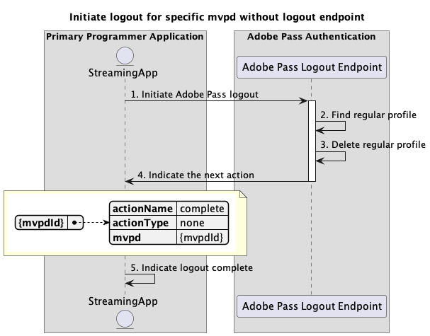

# Flusso di logout di base eseguito nell&#39;applicazione principale {#basic-logout-flow-performed-within-primary-application}

>[!IMPORTANT]
>
> Il contenuto di questa pagina viene fornito solo a scopo informativo. L’utilizzo di questa API richiede una licenza corrente da Adobe. Non è consentito alcun uso non autorizzato.

>[!IMPORTANT]
>
> L&#39;implementazione REST API V2 è limitata dalla documentazione del [meccanismo di limitazione](/help/authentication/integration-guide-programmers/throttling-mechanism.md).

Il **Flusso di disconnessione** all&#39;interno del diritto di autenticazione di Adobe Pass consente all&#39;applicazione di streaming di eseguire due passaggi principali:

* Elimina i profili normali salvati nel backend di Adobe Pass.
* Utilizza un agente utente (browser) per passare all’endpoint di disconnessione MVPD, attivando una pulizia nel backend MVPD.

Flusso di logout di base consente di eseguire query per i seguenti scenari:

* [Avvia disconnessione per mvpd specifico con endpoint di disconnessione](#initiate-logout-for-specific-mvpd-with-logout-endpoint)
* [Avvia disconnessione per mvpd specifico senza endpoint di disconnessione](#initiate-logout-for-specific-mvpd-without-logout-endpoint)

## Avvia disconnessione per mvpd specifico con endpoint di disconnessione {#initiate-logout-for-specific-mvpd-with-logout-endpoint}

### Prerequisiti {#prerequisites-initiate-logout-for-specific-mvpd-with-logout-endpoint}

Prima di avviare la disconnessione per un MVPD specifico con un endpoint di disconnessione, verificare che siano soddisfatti i seguenti prerequisiti:

* L’applicazione di streaming deve disporre di un profilo regolare valido creato correttamente per MVPD utilizzando uno dei flussi di autenticazione di base:
   * [Eseguire l&#39;autenticazione nell&#39;applicazione principale](rest-api-v2-basic-authentication-primary-application-flow.md)
   * [Eseguire l&#39;autenticazione nell&#39;applicazione secondaria con mvpd preselezionato](rest-api-v2-basic-authentication-secondary-application-flow.md)
   * [Eseguire l&#39;autenticazione nell&#39;applicazione secondaria senza mvpd preselezionato](rest-api-v2-basic-authentication-secondary-application-flow.md)
* L&#39;applicazione di streaming deve avviare il flusso di logout quando deve disconnettersi da MVPD.

>[!IMPORTANT]
>
> Presupposti
>
>  
> 
> * MVPD supporta il flusso di logout e dispone di un endpoint di logout.

### Flusso di lavoro {#workflow-initiate-logout-for-specific-mvpd-with-logout-endpoint}

Seguire i passaggi forniti per implementare il flusso di logout di base per un MVPD specifico con un endpoint di logout eseguito all&#39;interno di un&#39;applicazione primaria, come illustrato nel diagramma seguente.

*Avvia disconnessione per mvpd specifico con endpoint di disconnessione*

1. **Avvia disconnessione di Adobe Pass:** L&#39;applicazione di streaming raccoglie tutti i dati necessari per avviare il flusso di disconnessione chiamando l&#39;endpoint di disconnessione di Adobe Pass.

   >[!IMPORTANT]
   >
   > Per informazioni dettagliate su: [Avvia disconnessione per la documentazione API specifica di mvpd](../../apis/logout-apis/rest-api-v2-logout-apis-initiate-logout-for-specific-mvpd.md):
   >
   > * Tutti i parametri _required_, come `serviceProvider`, `mvpd` e `redirectUrl`
   > * Tutte le intestazioni _required_, come `Authorization`, `AP-Device-Identifier`
   > * Tutti i parametri e le intestazioni _optional_

1. **Trova profilo regolare:** Il server Adobe Pass identifica un profilo valido in base ai parametri e alle intestazioni ricevuti.

1. **Elimina profilo normale:** Il server Adobe Pass elimina il profilo normale identificato dal backend di Adobe Pass.

1. **Indicare l&#39;azione successiva:** La risposta dell&#39;endpoint di disconnessione di Adobe Pass contiene i dati necessari per guidare l&#39;applicazione di streaming per quanto riguarda l&#39;azione successiva:
   * L&#39;attributo `url` è presente perché MVPD supporta il flusso di disconnessione.
   * L&#39;attributo `actionName` è impostato su &quot;logout&quot;.
   * L&#39;attributo `actionType` è impostato su &quot;interactive&quot;.

   >[!IMPORTANT]
   >
   > Per informazioni dettagliate sulle informazioni fornite in una risposta di disconnessione, consultare la [Iniziare la disconnessione per la documentazione API mvpd](../../apis/logout-apis/rest-api-v2-logout-apis-initiate-logout-for-specific-mvpd.md) specifica.
   > 
   >  
   > 
   > L’endpoint di disconnessione di Adobe Pass convalida i dati della richiesta per garantire che siano soddisfatte le condizioni di base:
   >
   > * I parametri e le intestazioni _required_ devono essere validi.
   > * L&#39;integrazione tra `serviceProvider` e `mvpd` specificati deve essere attiva.
   >
   >  
   > 
   > Se la convalida non riesce, verrà generata una risposta di errore che fornirà informazioni aggiuntive conformi alla documentazione di [Codici di errore avanzati](../../../../features-standard/error-reporting/enhanced-error-codes.md).

1. **Avvia disconnessione MVPD:** L&#39;applicazione di streaming legge `url` e utilizza un agente utente per avviare il flusso di disconnessione con MVPD. Il flusso può includere diversi reindirizzamenti ai sistemi MVPD. Tuttavia, il risultato è che MVPD esegue la pulizia interna e invia la conferma di disconnessione finale al backend di Adobe Pass.

1. **Indicare disconnessione completata:** L&#39;applicazione di streaming può attendere che l&#39;agente utente raggiunga il `redirectUrl` specificato e può utilizzarlo come segnale per visualizzare facoltativamente un messaggio specifico nell&#39;interfaccia utente.

## Avvia disconnessione per mvpd specifico senza endpoint di disconnessione {#initiate-logout-for-specific-mvpd-without-logout-endpoint}

### Prerequisiti {#prerequisites-initiate-logout-for-specific-mvpd-without-logout-endpoint}

Prima di avviare la disconnessione per un MVPD specifico senza un endpoint di disconnessione, verificare che siano soddisfatti i seguenti prerequisiti:

* L’applicazione di streaming deve disporre di un profilo regolare valido creato correttamente per MVPD utilizzando uno dei flussi di autenticazione di base:
   * [Eseguire l&#39;autenticazione nell&#39;applicazione principale](rest-api-v2-basic-authentication-primary-application-flow.md)
   * [Eseguire l&#39;autenticazione nell&#39;applicazione secondaria con mvpd preselezionato](rest-api-v2-basic-authentication-secondary-application-flow.md)
   * [Eseguire l&#39;autenticazione nell&#39;applicazione secondaria senza mvpd preselezionato](rest-api-v2-basic-authentication-secondary-application-flow.md)
* L&#39;applicazione di streaming deve avviare il flusso di logout quando deve disconnettersi da MVPD.

>[!IMPORTANT]
>
> Presupposti
>
>  
> 
> * MVPD non supporta il flusso di logout e non dispone di un endpoint di logout.

### Flusso di lavoro {#workflow-initiate-logout-for-specific-mvpd-without-logout-endpoint}

Segui i passaggi forniti per implementare il flusso di logout di base per un MVPD specifico senza un endpoint di logout eseguito all’interno di un’applicazione primaria, come illustrato nel diagramma seguente.

*Avvia disconnessione per mvpd specifico senza endpoint di disconnessione*

1. **Avvia disconnessione di Adobe Pass:** L&#39;applicazione di streaming raccoglie tutti i dati necessari per avviare il flusso di disconnessione chiamando l&#39;endpoint di disconnessione di Adobe Pass.

   >[!IMPORTANT]
   >
   > Per informazioni dettagliate su: [Avvia disconnessione per la documentazione API specifica di mvpd](../../apis/logout-apis/rest-api-v2-logout-apis-initiate-logout-for-specific-mvpd.md):
   >
   > * Tutti i parametri _required_, come `serviceProvider`, `mvpd` e `redirectUrl`
   > * Tutte le intestazioni _required_, come `Authorization`, `AP-Device-Identifier`
   > * Tutti i parametri e le intestazioni _optional_

1. **Trova profilo regolare:** Il server Adobe Pass identifica un profilo valido in base ai parametri e alle intestazioni ricevuti.

1. **Elimina profilo normale:** Il server Adobe Pass elimina il profilo normale identificato.

1. **Indicare l&#39;azione successiva:** La risposta dell&#39;endpoint di disconnessione di Adobe Pass contiene i dati necessari per guidare l&#39;applicazione di streaming per quanto riguarda l&#39;azione successiva:
   * Attributo `url` mancante perché MVPD non supporta il flusso di disconnessione.
   * L&#39;attributo `actionName` è impostato su &quot;complete&quot;.
   * L&#39;attributo `actionType` è impostato su &quot;none&quot;.

   >[!IMPORTANT]
   >
   > Per informazioni dettagliate sulle informazioni fornite in una risposta di disconnessione, consultare la [Iniziare la disconnessione per la documentazione API mvpd](../../apis/logout-apis/rest-api-v2-logout-apis-initiate-logout-for-specific-mvpd.md) specifica.
   > 
   >  
   > 
   > L’endpoint di disconnessione di Adobe Pass convalida i dati della richiesta per garantire che siano soddisfatte le condizioni di base:
   >
   > * I parametri e le intestazioni _required_ devono essere validi.
   > * L&#39;integrazione tra `serviceProvider` e `mvpd` specificati deve essere attiva.
   >
   >  
   > 
   > Se la convalida non riesce, verrà generata una risposta di errore che fornirà informazioni aggiuntive conformi alla documentazione di [Codici di errore avanzati](../../../../features-standard/error-reporting/enhanced-error-codes.md).

1. **Indicare disconnessione completata:** L&#39;applicazione di streaming elabora la risposta e può utilizzarla per visualizzare facoltativamente un messaggio specifico nell&#39;interfaccia utente.
