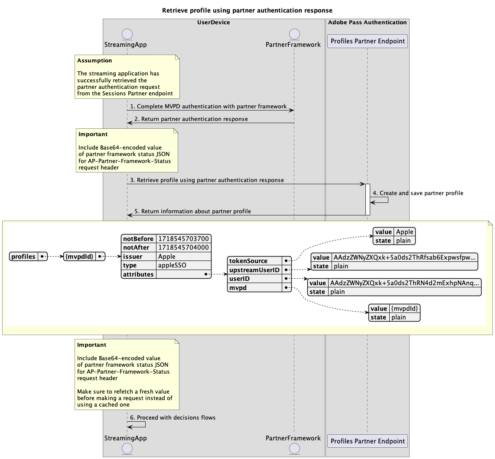

# Single sign-on con flussi di partner {#single-sign-on-partner-flows}

>[!IMPORTANT]
>
> Il contenuto di questa pagina viene fornito solo a scopo informativo. L’utilizzo di questa API richiede una licenza corrente da Adobe. Non è consentito alcun uso non autorizzato.

>[!IMPORTANT]
>
> L&#39;implementazione REST API V2 è limitata dalla documentazione del [meccanismo di limitazione](/help/authentication/integration-guide-programmers/throttling-mechanism.md).

>[!MORELIKETHIS]
>
> Visita anche le [Domande frequenti su REST API V2](/help/authentication/integration-guide-programmers/rest-apis/rest-api-v2/rest-api-v2-faqs.md#authentication-phase-faqs-general).

Il metodo Partner consente a più applicazioni di utilizzare un payload di stato del framework partner per ottenere un Single Sign-On (SSO) a livello di dispositivo quando si utilizzano i servizi Adobe Pass.

Le applicazioni sono responsabili del recupero del payload dello stato del framework del partner utilizzando framework o librerie specifici del partner al di fuori dei sistemi Adobe Pass.

Le applicazioni sono responsabili dell&#39;inclusione del payload dello stato del framework partner come parte dell&#39;intestazione `AP-Partner-Framework-Status` per tutte le richieste che lo specificano.

Per ulteriori dettagli sull&#39;intestazione `AP-Partner-Framework-Status`, consulta la documentazione [AP-Partner-Framework-Status](../../appendix/headers/rest-api-v2-appendix-headers-ap-partner-framework-status.md).

L’API REST per l’autenticazione di Adobe Pass V2 supporta l’SSO (Single Sign-On) per i partner per gli utenti finali delle applicazioni client in esecuzione su iOS, iPadOS o tvOS.

Per ulteriori dettagli sul Single Sign-On (SSO) per la piattaforma Apple, consulta la documentazione [Manuale Apple SSO (REST API V2)](/help/authentication/integration-guide-programmers/features-standard/sso-access/partner-sso/apple-sso/apple-sso-cookbook-rest-api-v2.md).

## Recupera richiesta di autenticazione partner {#retrieve-partner-authentication-request}

### Prerequisiti {#prerequisites-retrieve-partner-authentication-request}

Prima di recuperare la richiesta di autenticazione del partner, accertati che siano soddisfatti i seguenti prerequisiti:

* Il framework partner deve selezionare un MVPD.
* L’applicazione di streaming deve ottenere le informazioni sullo stato del framework del partner dal framework del partner e trasmetterle al server Adobe Pass.
* L’applicazione di streaming deve ottenere la richiesta di autenticazione del partner dal server Adobe Pass e trasmetterla al framework del partner.

>[!IMPORTANT]
>
> Presupposti
> 
>  
> 
> * Il framework partner supporta l&#39;interazione dell&#39;utente per selezionare un MVPD.
> * Il framework partner supporta l’interazione dell’utente per l’autenticazione con il MVPD selezionato.
> * Il framework partner fornisce le autorizzazioni utente e le informazioni sul provider.

### Flusso di lavoro {#workflow-retrieve-partner-authentication-request}

Effettua i passaggi forniti per recuperare la richiesta di autenticazione del partner come mostrato nel diagramma seguente.

*Recupera richiesta di autenticazione partner*

1. **Recupera stato framework partner:** L&#39;applicazione di streaming chiama il framework partner, al di fuori dei sistemi Adobe Pass, per ottenere le autorizzazioni utente e le informazioni sul provider.

1. **Restituisci informazioni sullo stato del framework partner:** L&#39;applicazione di streaming convalida i dati di risposta per verificare che siano soddisfatte le condizioni di base:
   * Lo stato di accesso dell’autorizzazione utente è concesso.
   * Identificatore di mapping del provider utente presente e valido.
   * La data di scadenza del profilo del provider utente (se disponibile) è valida.

1. **Recupera richiesta di autenticazione partner:** L&#39;applicazione di streaming raccoglie tutti i dati necessari per avviare una sessione di autenticazione chiamando l&#39;endpoint Sessions Partner.

   >[!IMPORTANT]
   >
   > Per informazioni dettagliate su [Recuperare la richiesta di autenticazione partner](../../apis/partner-single-sign-on-apis/rest-api-v2-partner-single-sign-on-apis-retrieve-partner-authentication-request.md), consulta la documentazione API di:
   >
   > * Tutti i parametri _required_, come `serviceProvider` e `partner`
   > * Tutte le intestazioni _required_ come `Authorization`, `AP-Device-Identifier`, `Content-Type`, `X-Device-Info` e `AP-Partner-Framework-Status`
   > * Tutte le intestazioni e i parametri _optional_
   >
   >  
   >
   > Prima di effettuare una richiesta, l’applicazione di streaming deve verificare di includere un valore valido per lo stato del framework del partner.
   >
   >  
   > 
   > Per ulteriori dettagli sull&#39;intestazione `AP-Partner-Framework-Status`, consulta la documentazione [AP-Partner-Framework-Status](../../appendix/headers/rest-api-v2-appendix-headers-ap-partner-framework-status.md).

1. **Indicare l&#39;azione successiva:** La risposta dell&#39;endpoint Sessions Partner contiene i dati necessari per guidare l&#39;applicazione di streaming per quanto riguarda l&#39;azione successiva.

   >[!IMPORTANT]
   >
   > Per informazioni dettagliate sulle informazioni fornite in una risposta della sessione, consultare la documentazione API [Recupera richiesta di autenticazione partner](../../apis/partner-single-sign-on-apis/rest-api-v2-partner-single-sign-on-apis-retrieve-partner-authentication-request.md).
   > 
   >  
   > 
   > L’endpoint Sessions Partner convalida i dati della richiesta per garantire che siano soddisfatte le condizioni di base:
   >
   > * I parametri e le intestazioni _required_ devono essere validi.
   > * L&#39;integrazione tra `serviceProvider` e `mvpd` specificati deve essere attiva.
   >
   >  
   > 
   > Se la convalida di base non riesce, verrà generata una risposta di errore che fornirà informazioni aggiuntive conformi alla documentazione di [Codici di errore avanzati](../../../../features-standard/error-reporting/enhanced-error-codes.md).
   >
   >  
   >
   > L’endpoint Sessions Partner convalida i dati della richiesta per garantire che vengano soddisfatte le condizioni di single sign-on del partner:
   >
   >  * La configurazione Single Sign-On del partner nel server Adobe Pass deve essere valida e abilitata.
   >  * Il payload dello stato del framework partner ricevuto tramite l&#39;intestazione [AP-Partner-Framework-Status](../../appendix/headers/rest-api-v2-appendix-headers-ap-partner-framework-status.md) deve essere valido.
   >
   >  
   >
   > Se la convalida Single Sign-On del partner non riesce, la risposta viene impostata come flusso di autenticazione di base per impostazione predefinita.

1. **Procedere con il flusso di recupero del profilo utilizzando la risposta di autenticazione partner:** La risposta dell&#39;endpoint Partner sessioni contiene i dati seguenti:
   * L&#39;attributo `actionName` è impostato su &quot;partner_profile&quot;.
   * L&#39;attributo `actionType` è impostato su &quot;direct&quot;.
   * L&#39;attributo `authenticationRequest - type` include il protocollo di sicurezza utilizzato dal framework partner per l&#39;accesso a MVPD (attualmente impostato solo su SAML).
   * L&#39;attributo `authenticationRequest - request` include la richiesta SAML passata al framework partner.
   * L&#39;attributo `authenticationRequest - attributesNames` include gli attributi SAML passati al framework partner.

   Se il backend di Adobe Pass non identifica un profilo valido e il partner passa la convalida single sign-on, l’applicazione di streaming riceve una risposta con azioni e dati da passare al framework partner per avviare il flusso di autenticazione con MVPD.

   Per ulteriori dettagli sul flusso di recupero dei profili tramite una risposta di autenticazione del partner, fare riferimento alla sezione [Creare e recuperare il profilo utilizzando la risposta di autenticazione del partner](#create-and-retrieve-profile-using-partner-authentication-response).

1. **Procedi con il flusso di autenticazione di base:** La risposta dell&#39;endpoint Sessions Partner contiene i dati seguenti:
   * L&#39;attributo `actionName` è impostato su &quot;authenticate&quot; o &quot;resume&quot;.
   * L&#39;attributo `actionType` è impostato su &quot;interactive&quot; o &quot;direct&quot;.

   Se il backend di Adobe Pass non identifica un profilo valido e la convalida single sign-on del partner non riesce, il server Adobe Pass torna al flusso di autenticazione di base.

   Per ulteriori dettagli sul flusso di autenticazione di base, consulta i seguenti documenti:
   * [Eseguire l&#39;autenticazione nell&#39;applicazione principale](../basic-access-flows/rest-api-v2-basic-authentication-primary-application-flow.md)
   * [Eseguire l&#39;autenticazione nell&#39;applicazione secondaria con mvpd preselezionato](../basic-access-flows/rest-api-v2-basic-authentication-secondary-application-flow.md)
   * [Eseguire l&#39;autenticazione nell&#39;applicazione secondaria senza mvpd preselezionato](../basic-access-flows/rest-api-v2-basic-authentication-secondary-application-flow.md)

1. **Procedi con i flussi di decisioni:** La risposta dell&#39;endpoint del partner sessioni contiene i dati seguenti:
   * L&#39;attributo `actionName` è impostato su &quot;authorize&quot;.
   * L&#39;attributo `actionType` è impostato su &quot;direct&quot;.

   Se il backend di Adobe Pass identifica un profilo valido, non è necessario che l’applicazione di streaming autentichi nuovamente con il MVPD selezionato, in quanto esiste già un profilo che può essere utilizzato per i flussi decisionali successivi.

   >[!IMPORTANT]
   >
   > Prima di effettuare una richiesta, l’applicazione di streaming deve verificare di includere un valore valido per lo stato del framework del partner.
   >
   >  
   > 
   > Per ulteriori dettagli sull&#39;intestazione `AP-Partner-Framework-Status`, consulta la documentazione [AP-Partner-Framework-Status](../../appendix/headers/rest-api-v2-appendix-headers-ap-partner-framework-status.md).

## Crea e recupera il profilo utilizzando la risposta di autenticazione del partner {#create-and-retrieve-profile-using-partner-authentication-response}

### Prerequisiti {#prerequisites-create-and-retrieve-profile-using-partner-authentication-response}

Prima di recuperare il profilo utilizzando una risposta di autenticazione del partner, verifica che siano soddisfatti i seguenti prerequisiti:

* Il framework partner deve eseguire l&#39;autenticazione con il MVPD selezionato.
* L’applicazione di streaming deve ottenere la risposta di autenticazione del partner insieme alle informazioni sullo stato del framework del partner dal framework del partner e trasmetterla al server Adobe Pass.

>[!IMPORTANT]
>
> Presunzione
>
> * Il framework partner supporta l&#39;interazione dell&#39;utente per selezionare un MVPD.
> * Il framework partner supporta l’interazione dell’utente per l’autenticazione con il MVPD selezionato.
> * Il framework partner fornisce le autorizzazioni utente e le informazioni sul provider.

### Flusso di lavoro {#workflow-create-and-retrieve-profile-using-partner-authentication-response}

Esegui i passaggi forniti per implementare il flusso di recupero del profilo utilizzando una risposta di autenticazione del partner come mostrato nel diagramma seguente.

*Crea e recupera il profilo autenticato utilizzando la risposta di autenticazione partner*

1. **Completare l&#39;autenticazione di MVPD con il framework partner:** Se il flusso di autenticazione ha esito positivo, l&#39;interazione del framework partner con MVPD genera una risposta di autenticazione partner (risposta SAML) restituita insieme alle informazioni sullo stato del framework partner.

1. **Risposta di autenticazione partner di ritorno:** L&#39;applicazione di streaming convalida i dati di risposta per verificare che siano soddisfatte le condizioni di base:
   * Lo stato di accesso dell’autorizzazione utente è concesso.
   * Identificatore di mapping del provider utente presente e valido.
   * La data di scadenza del profilo del provider utente (se disponibile) è valida.

1. **Crea e recupera il profilo utilizzando la risposta di autenticazione del partner:** L&#39;applicazione di streaming raccoglie tutti i dati necessari per creare e recuperare un profilo chiamando l&#39;endpoint del partner Profili.

   >[!IMPORTANT]
   >
   > Per informazioni dettagliate su [Creare e recuperare il profilo utilizzando la risposta di autenticazione partner](../../apis/partner-single-sign-on-apis/rest-api-v2-partner-single-sign-on-apis-retrieve-profile-using-partner-authentication-response.md), consulta la documentazione API per:
   >
   > * Tutti i parametri _required_, come `serviceProvider`, `partner` e `SAMLResponse`
   > * Tutte le intestazioni _required_, come `Authorization`, `AP-Device-Identifier`, `Content-Type`, `X-Device-Info` e `AP-Partner-Framework-Status`
   > * Tutte le intestazioni e i parametri _optional_
   >
   >  
   > 
   > Prima di effettuare una richiesta, l’applicazione di streaming deve verificare di includere un valore valido per lo stato del framework del partner.
   >
   >  
   > 
   > Per ulteriori dettagli sull&#39;intestazione `AP-Partner-Framework-Status`, consulta la documentazione [AP-Partner-Framework-Status](../../appendix/headers/rest-api-v2-appendix-headers-ap-partner-framework-status.md).

1. **Crea e salva profilo partner:** Il server Adobe Pass crea e salva un profilo partner dopo aver verificato che tutte le condizioni siano soddisfatte.

1. **Restituire informazioni sul profilo partner:** La risposta dell&#39;endpoint Profiles contiene informazioni sul profilo partner, incluso l&#39;attributo `type` impostato su &quot;appleSSO&quot;.

   >[!IMPORTANT]
   >
   > Per informazioni dettagliate sulle informazioni fornite in una risposta del profilo, consulta la documentazione API [Crea e recupera il profilo utilizzando la risposta di autenticazione del partner](../../apis/partner-single-sign-on-apis/rest-api-v2-partner-single-sign-on-apis-retrieve-profile-using-partner-authentication-response.md).
   > 
   >  
   > 
   > L’endpoint Partner Profili convalida i dati della richiesta per garantire che siano soddisfatte le condizioni di base:
   >
   > * I parametri e le intestazioni _required_ devono essere validi.
   > * L&#39;integrazione tra `serviceProvider` e `mvpd` specificati deve essere attiva.
   >
   >  
   > 
   > Se la convalida non riesce, verrà generata una risposta di errore che fornirà informazioni aggiuntive conformi alla documentazione di [Codici di errore avanzati](../../../../features-standard/error-reporting/enhanced-error-codes.md).
   >
   >  
   >
   > L’endpoint Partner Profili convalida i dati della richiesta per garantire che siano soddisfatte le condizioni di single sign-on del partner:
   >
   >  * La configurazione Single Sign-On del partner nel server Adobe Pass deve essere valida e abilitata.
   >  * Il payload dello stato del framework partner ricevuto tramite l&#39;intestazione [AP-Partner-Framework-Status](../../appendix/headers/rest-api-v2-appendix-headers-ap-partner-framework-status.md) deve essere valido.
   >
   >  
   >
   > Se la convalida Single Sign-On del partner non riesce, la risposta viene impostata come predefinita sul flusso di recupero dei profili di base.

1. **Procedi con i flussi di decisioni:** L&#39;applicazione di streaming può continuare con i flussi di decisioni successivi.

   >[!IMPORTANT]
   >
   > Prima di effettuare una richiesta, l’applicazione di streaming deve verificare di includere un valore valido per lo stato del framework del partner.
   >
   >  
   > 
   > Per ulteriori dettagli sull&#39;intestazione `AP-Partner-Framework-Status`, consulta la documentazione [AP-Partner-Framework-Status](../../appendix/headers/rest-api-v2-appendix-headers-ap-partner-framework-status.md).
