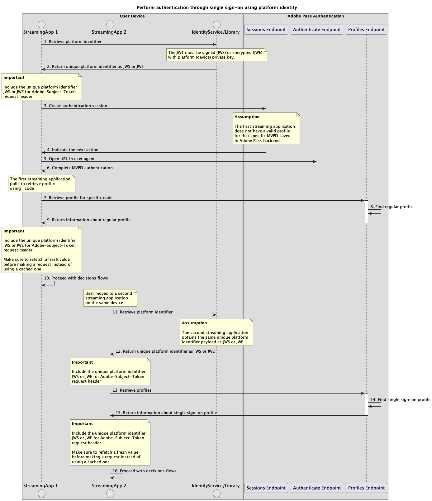

# Single sign-on con flussi di identità della piattaforma {#single-sign-on-platform-identity-full-flows}

>[!IMPORTANT]
>
> Il contenuto di questa pagina viene fornito solo a scopo informativo. L’utilizzo di questa API richiede una licenza corrente da Adobe. Non è consentito alcun uso non autorizzato.

>[!IMPORTANT]
>
> L&#39;implementazione REST API V2 è limitata dalla documentazione del [meccanismo di limitazione](/help/authentication/integration-guide-programmers/throttling-mechanism.md).

Il metodo Platform Identity consente a più applicazioni di utilizzare un identificatore univoco della piattaforma per ottenere un Single Sign-On (SSO) a livello di dispositivo o piattaforma quando si utilizzano i servizi Adobe Pass.

Le applicazioni sono responsabili del recupero del payload dell’identificatore univoco della piattaforma utilizzando servizi di identità o librerie specifici per il dispositivo al di fuori dei sistemi Adobe Pass.

Le applicazioni sono responsabili dell&#39;inclusione di questo payload di identificatore di piattaforma univoco nell&#39;intestazione `Adobe-Subject-Token` per tutte le richieste che lo specificano.

Per ulteriori dettagli sull&#39;intestazione `Adobe-Subject-Token`, consulta la documentazione [Adobe-Subject-Token](../../appendix/headers/rest-api-v2-appendix-headers-adobe-subject-token.md).

>[!MORELIKETHIS]
> 
> * [Manuale Amazon SSO](/help/authentication/integration-guide-programmers/features-standard/sso-access/platform-sso/amazon-single-sign-on/amazon-sso-cookbook-rest-api-v2.md)
> * [Manuale Roku SSO](/help/authentication/integration-guide-programmers/features-standard/sso-access/platform-sso/roku-single-sign-on/roku-sso-overview.md)

## Eseguire l’autenticazione tramite single sign-on utilizzando l’identità della piattaforma {#perform-authentication-through-single-sign-on-using-platform-identity}

### Prerequisiti {#prerequisites-perform-authentication-through-single-sign-on-using-platform-identity}

Prima di eseguire il flusso di autenticazione tramite single sign-on utilizzando un’identità di piattaforma, verifica che siano soddisfatti i seguenti prerequisiti:

* La piattaforma deve fornire un servizio o una libreria Identity che restituisca informazioni coerenti come payload `JWS` o `JWE` in tutte le applicazioni sullo stesso dispositivo o piattaforma.
* La prima applicazione di streaming deve recuperare l&#39;identificatore univoco della piattaforma e includere il payload `JWS` o `JWE` come parte dell&#39;intestazione [Adobe-Subject-Token](../../appendix/headers/rest-api-v2-appendix-headers-adobe-subject-token.md) per tutte le richieste che lo specificano.
* La prima applicazione di streaming deve selezionare un MVPD.
* La prima applicazione di streaming deve avviare una sessione di autenticazione per accedere con il MVPD selezionato.
* La prima applicazione di streaming deve eseguire l’autenticazione con il MVPD selezionato in un agente utente.
* La seconda applicazione di streaming deve recuperare l&#39;identificatore univoco della piattaforma e includere il payload `JWS` o `JWE` come parte dell&#39;intestazione [Adobe-Subject-Token](../../appendix/headers/rest-api-v2-appendix-headers-adobe-subject-token.md) per tutte le richieste che lo specificano.

>[!IMPORTANT]
>
> Presupposti
>
>  
> 
> * La prima applicazione di streaming supporta l’interazione dell’utente per selezionare un MVPD.
> * La prima applicazione di streaming supporta l’interazione dell’utente per l’autenticazione con il MVPD selezionato in un agente utente.

### Flusso di lavoro {#workflow-perform-authentication-through-single-sign-on-using-platform-identity}

Per implementare il flusso di autenticazione tramite single sign-on, esegui i passaggi forniti utilizzando un’identità di piattaforma, come illustrato nel diagramma seguente.

*Eseguire l&#39;autenticazione tramite Single Sign-On utilizzando l&#39;identità della piattaforma*

1. **Recupera identificatore piattaforma:** La prima applicazione di streaming chiama il servizio o la libreria Identity, al di fuori dei sistemi Adobe Pass, per ottenere il payload `JWS` o `JWE` associato all&#39;identificatore piattaforma univoco.

1. **Restituire l&#39;identificatore univoco della piattaforma come JWS o JWE:** La prima applicazione di streaming convalida i dati di risposta per garantire il rispetto delle condizioni di sicurezza di base:
   * Payload non scaduto.
   * Payload firmato o crittografato.

1. **Crea sessione di autenticazione:** La prima applicazione di streaming raccoglie tutti i dati necessari per avviare una sessione di autenticazione chiamando l&#39;endpoint Sessions.

   >[!IMPORTANT]
   >
   > Per informazioni dettagliate su [Crea sessione di autenticazione](../../apis/sessions-apis/rest-api-v2-sessions-apis-create-authentication-session.md), consulta la documentazione API di:
   > 
   > * Tutti i parametri _required_, come `serviceProvider`, `mvpd`, `domainName` e `redirectUrl`
   > * Tutte le intestazioni _required_, come `Authorization`, `AP-Device-Identifier`
   > * Tutti i parametri e le intestazioni _optional_
   >
   >  
   > 
   > Prima di effettuare una richiesta, l’applicazione di streaming deve verificare di includere un valore valido per l’identificatore univoco della piattaforma.
   >
   >  
   > 
   > Per ulteriori dettagli sull&#39;intestazione `Adobe-Subject-Token`, consulta la documentazione [Adobe-Subject-Token](../../appendix/headers/rest-api-v2-appendix-headers-adobe-subject-token.md).

1. **Indicare l&#39;azione successiva:** La risposta dell&#39;endpoint Sessions contiene i dati necessari per guidare la prima applicazione di streaming per quanto riguarda l&#39;azione successiva.

   >[!IMPORTANT]
   >
   > Per informazioni dettagliate sulle informazioni fornite in una risposta di sessione, consulta la documentazione API [Crea sessione di autenticazione](../../apis/sessions-apis/rest-api-v2-sessions-apis-create-authentication-session.md).
   > 
   >  
   > 
   > L’endpoint Sessions convalida i dati della richiesta per garantire che siano soddisfatte le condizioni di base:
   >
   > * I parametri e le intestazioni _required_ devono essere validi.
   > * L&#39;integrazione tra `serviceProvider` e `mvpd` specificati deve essere attiva.
   >
   >  
   > 
   > Se la convalida non riesce, verrà generata una risposta di errore che fornirà informazioni aggiuntive conformi alla documentazione di [Codici di errore avanzati](../../../../features-standard/error-reporting/enhanced-error-codes.md).

1. **Apri URL nell&#39;agente utente:** La risposta dell&#39;endpoint Sessions contiene i dati seguenti:
   * `url` che può essere utilizzato per avviare l&#39;autenticazione interattiva nella pagina di accesso di MVPD.
   * L&#39;attributo `actionName` è impostato per l&#39;autenticazione.
   * L&#39;attributo `actionType` è impostato su &quot;interactive&quot;.

   Se il backend di Adobe Pass non identifica un profilo valido, la prima applicazione di streaming apre un agente utente per caricare l&#39;elemento `url` fornito, effettuando una richiesta all&#39;endpoint Authenticate. Questo flusso può includere diversi reindirizzamenti, che portano l’utente alla pagina di accesso di MVPD e forniscono credenziali valide.

1. **Autenticazione MVPD completa:** se il flusso di autenticazione ha esito positivo, l&#39;interazione dell&#39;agente utente salva un profilo regolare nel backend di Adobe Pass e raggiunge il `redirectUrl` fornito.

1. **Recupera profilo per codice specifico:** La prima applicazione di streaming raccoglie tutti i dati necessari per recuperare le informazioni sul profilo inviando una richiesta all&#39;endpoint Profili.

   >[!IMPORTANT]
   >
   > Per informazioni dettagliate su [Recupera profilo per codice specifico](../../apis/profiles-apis/rest-api-v2-profiles-apis-retrieve-profile-for-specific-code.md), consulta la documentazione API per:
   > 
   > * Tutti i parametri _required_, come `serviceProvider`, `code`
   > * Tutte le intestazioni _required_, come `Authorization`, `AP-Device-Identifier`
   > * Tutti i parametri e le intestazioni _optional_

   >[!TIP]
   >
   > Suggerimento: l&#39;applicazione di streaming può attendere che l&#39;agente utente raggiunga il `redirectUrl` fornito per verificare se il profilo regolare è stato generato e salvato correttamente.

1. **Trova profilo regolare:** Il server Adobe Pass identifica un profilo valido in base ai parametri e alle intestazioni ricevuti.

1. **Restituisci informazioni sul profilo regolare:** La risposta dell&#39;endpoint Profiles contiene informazioni sul profilo trovato associato ai parametri e alle intestazioni ricevuti.

   >[!IMPORTANT]
   >
   > Per informazioni dettagliate sulle informazioni fornite in una risposta al profilo, consulta la documentazione API [Recupera profilo per codice specifico](../../apis/profiles-apis/rest-api-v2-profiles-apis-retrieve-profile-for-specific-code.md).
   > 
   >  
   > 
   > L’endpoint Profili convalida i dati della richiesta per garantire che siano soddisfatte le condizioni di base:
   >
   > * I parametri e le intestazioni _required_ devono essere validi.
   >
   >  
   > 
   > Se la convalida non riesce, verrà generata una risposta di errore che fornirà informazioni aggiuntive conformi alla documentazione di [Codici di errore avanzati](../../../../features-standard/error-reporting/enhanced-error-codes.md).

1. **Procedi con i flussi di decisioni:** La prima applicazione di streaming può continuare con i flussi di decisioni successivi.

   >[!IMPORTANT]
   >
   > Prima di effettuare una richiesta, l’applicazione di streaming deve verificare di includere un valore valido per l’identificatore univoco della piattaforma.
   >
   >  
   > 
   > Per ulteriori dettagli sull&#39;intestazione `Adobe-Subject-Token`, consulta la documentazione [Adobe-Subject-Token](../../appendix/headers/rest-api-v2-appendix-headers-adobe-subject-token.md).

1. **Recupera identificatore piattaforma:** La seconda applicazione di streaming chiama il servizio o la libreria Identity, al di fuori dei sistemi Adobe Pass, per ottenere il payload `JWS` o `JWE` associato all&#39;identificatore piattaforma univoco.

1. **Restituire l&#39;identificatore univoco della piattaforma come JWS o JWE:** La seconda applicazione di streaming convalida i dati di risposta per garantire il rispetto delle condizioni di sicurezza di base:
   * Payload non scaduto.
   * Payload firmato o crittografato.

1. **Recupera profili:** La seconda applicazione di streaming raccoglie tutti i dati necessari per recuperare tutte le informazioni sui profili inviando una richiesta all&#39;endpoint Profili.

   >[!IMPORTANT]
   >
   > Per informazioni dettagliate su [Recuperare i profili](../../apis/profiles-apis/rest-api-v2-profiles-apis-retrieve-profiles.md), consulta la documentazione API di:
   > 
   > * Tutti i parametri _required_, come `serviceProvider`
   > * Tutte le intestazioni _required_, come `Authorization`, `AP-Device-Identifier`
   > * Tutti i parametri e le intestazioni _optional_
   >
   >  
   > 
   > Prima di effettuare una richiesta, l’applicazione di streaming deve verificare di includere un valore valido per l’identificatore univoco della piattaforma.
   >
   >  
   > 
   > Per ulteriori dettagli sull&#39;intestazione `Adobe-Subject-Token`, consulta la documentazione [Adobe-Subject-Token](../../appendix/headers/rest-api-v2-appendix-headers-adobe-subject-token.md).

1. **Trova profilo Single Sign-On:** Il server Adobe Pass identifica un profilo Single Sign-On valido in base ai parametri e alle intestazioni ricevuti.

1. **Restituire informazioni sul profilo Single Sign-On:** La risposta dell&#39;endpoint Profiles contiene informazioni sul profilo trovato associato ai parametri e alle intestazioni ricevuti.

   >[!IMPORTANT]
   >
   > Per informazioni dettagliate sulle informazioni fornite in una risposta al profilo, consulta la documentazione dell&#39;API [Recupera profili](../../apis/profiles-apis/rest-api-v2-profiles-apis-retrieve-profiles.md).
   >
   >  
   > 
   > L’endpoint Profili convalida i dati della richiesta per garantire che siano soddisfatte le condizioni di base:
   >
   > * I parametri e le intestazioni _required_ devono essere validi.
   >
   >  
   > 
   > Se la convalida non riesce, verrà generata una risposta di errore che fornirà informazioni aggiuntive conformi alla documentazione di [Codici di errore avanzati](../../../../features-standard/error-reporting/enhanced-error-codes.md).

1. **Procedi con i flussi di decisioni:** La seconda applicazione di streaming può continuare con i flussi di decisioni successivi.

   >[!IMPORTANT]
   >
   > Prima di effettuare una richiesta, l’applicazione di streaming deve verificare di includere un valore valido per l’identificatore univoco della piattaforma.
   >
   >  
   > 
   > Per ulteriori dettagli sull&#39;intestazione `Adobe-Subject-Token`, consulta la documentazione [Adobe-Subject-Token](../../appendix/headers/rest-api-v2-appendix-headers-adobe-subject-token.md).

## Recuperare le decisioni di autorizzazione tramite single sign-on utilizzando l’identità della piattaforma{#performing-authorization-flow-using-platform-identity-single-sign-on-method}

### Prerequisiti {#prerequisites-scenario-performing-authorization-flow-using-platform-identity-single-sign-on-method}

Prima di eseguire il flusso di autorizzazione tramite single sign-on utilizzando un’identità di piattaforma, verifica che siano soddisfatti i seguenti prerequisiti:

* La piattaforma deve fornire un servizio o una libreria Identity che restituisca informazioni coerenti come payload `JWS` o `JWE` in tutte le applicazioni sullo stesso dispositivo o piattaforma.
* La seconda applicazione di streaming deve recuperare l&#39;identificatore univoco della piattaforma e includere il payload `JWS` o `JWE` come parte dell&#39;intestazione [Adobe-Subject-Token](../../appendix/headers/rest-api-v2-appendix-headers-adobe-subject-token.md) per tutte le richieste che lo specificano.
* La seconda applicazione di streaming deve recuperare una decisione di autorizzazione prima di riprodurre una risorsa selezionata dall’utente.

>[!IMPORTANT]
>
> Presupposti
> 
>  
> 
> * La prima applicazione di streaming ha eseguito l&#39;autenticazione e ha incluso un valore valido per l&#39;intestazione di richiesta [Adobe-Subject-Token](../../appendix/headers/rest-api-v2-appendix-headers-adobe-subject-token.md).

### Flusso di lavoro {#workflow-scenario-performing-authorization-flow-using-platform-identity-single-sign-on-method}

Eseguire i passaggi forniti per implementare il flusso di autorizzazione tramite single sign-on utilizzando un&#39;identità di piattaforma, come illustrato nel diagramma seguente.

*Recuperare le decisioni di autorizzazione tramite Single Sign-On utilizzando l&#39;identità della piattaforma*

1. **Recupera identificatore piattaforma:** La seconda applicazione di streaming chiama il servizio o la libreria Identity, al di fuori dei sistemi Adobe Pass, per ottenere il payload `JWS` o `JWE` associato all&#39;identificatore piattaforma univoco.

1. **Restituire l&#39;identificatore univoco della piattaforma come JWS o JWE:** La seconda applicazione di streaming convalida i dati di risposta per garantire il rispetto delle condizioni di sicurezza di base:
   * Payload non scaduto.
   * Payload firmato o crittografato.

1. **Recupera decisione di autorizzazione:** La seconda applicazione di streaming raccoglie tutti i dati necessari per ottenere una decisione di autorizzazione per una risorsa specifica chiamando l&#39;endpoint Decisions Authorize.

   >[!IMPORTANT]
   >
   > Per informazioni dettagliate su: [Recuperare le decisioni di autorizzazione utilizzando la documentazione API mvpd](../../apis/decisions-apis/rest-api-v2-decisions-apis-retrieve-authorization-decisions-using-specific-mvpd.md) specifica:
   >
   > * Tutti i parametri _required_, come `serviceProvider`, `mvpd` e `resources`
   > * Tutte le intestazioni _required_, come `Authorization` e `AP-Device-Identifier`
   > * Tutti i parametri e le intestazioni _optional_
   >
   >  
   > 
   > Prima di effettuare una richiesta, l’applicazione di streaming deve verificare di includere un valore valido per l’identificatore univoco della piattaforma.
   >
   >  
   > 
   > Per ulteriori dettagli sull&#39;intestazione `Adobe-Subject-Token`, consulta la documentazione [Adobe-Subject-Token](../../appendix/headers/rest-api-v2-appendix-headers-adobe-subject-token.md).

1. **Trova profilo Single Sign-On:** Il server Adobe Pass identifica un profilo Single Sign-On valido in base ai parametri e alle intestazioni ricevuti.

1. **Recupera decisione MVPD per la risorsa richiesta:** Il server Adobe Pass chiama l&#39;endpoint di autorizzazione MVPD per ottenere una decisione `Permit` o `Deny` per la risorsa specifica ricevuta dall&#39;applicazione di streaming.

1. **Restituisci decisione `Permit` con token multimediale:** La risposta dell&#39;endpoint Decisions Authorize contiene una decisione `Permit` e un token multimediale.

   >[!IMPORTANT]
   >
   > Per informazioni dettagliate sulle informazioni fornite in una risposta alla decisione, consulta la [documentazione API MVPD](../../apis/decisions-apis/rest-api-v2-decisions-apis-retrieve-authorization-decisions-using-specific-mvpd.md) specifica per il recupero delle decisioni di autorizzazione.
   > 
   >  
   > 
   > L’endpoint Decisions Authorize convalida i dati della richiesta per garantire che siano soddisfatte le condizioni di base:
   >
   > * I parametri e le intestazioni _required_ devono essere validi.
   > * L&#39;integrazione tra `serviceProvider` e `mvpd` specificati deve essere attiva.
   >
   >  
   > 
   > Se la convalida non riesce, verrà generata una risposta di errore che fornirà informazioni aggiuntive conformi alla documentazione di [Codici di errore avanzati](../../../../features-standard/error-reporting/enhanced-error-codes.md).

1. **Avvia flusso con token multimediale:** La seconda applicazione di streaming utilizza il token multimediale per riprodurre il contenuto.

1. **Restituisci decisione `Deny` con dettagli:** La risposta dell&#39;endpoint Decisions Authorize contiene una decisione `Deny` e un payload di errore conformi alla documentazione [Codici di errore migliorati](../../../../features-standard/error-reporting/enhanced-error-codes.md).

   >[!IMPORTANT]
   >
   > Per informazioni dettagliate sulle informazioni fornite in una risposta alla decisione, consulta la [documentazione API MVPD](../../apis/decisions-apis/rest-api-v2-decisions-apis-retrieve-authorization-decisions-using-specific-mvpd.md) specifica per il recupero delle decisioni di autorizzazione.
   > 
   >  
   > 
   > L’endpoint Decisions Authorize convalida i dati della richiesta per garantire che siano soddisfatte le condizioni di base:
   >
   > * I parametri e le intestazioni _required_ devono essere validi.
   > * L&#39;integrazione tra `serviceProvider` e `mvpd` specificati deve essere attiva.
   >
   >  
   > 
   > Se la convalida non riesce, verrà generata una risposta di errore che fornirà informazioni aggiuntive conformi alla documentazione di [Codici di errore avanzati](../../../../features-standard/error-reporting/enhanced-error-codes.md).

1. **Gestire i dettagli della decisione `Deny`:** La seconda applicazione di streaming elabora le informazioni sull&#39;errore dalla risposta e può utilizzarle per visualizzare facoltativamente un messaggio specifico nell&#39;interfaccia utente.

>[!NOTE]
>
> I passaggi per il flusso di preautorizzazione sono gli stessi del flusso di autorizzazione, tranne per il fatto che l&#39;endpoint utilizzato è quello descritto nella [Documentazione di recupero delle decisioni di preautorizzazione utilizzando mvpd](../../apis/decisions-apis/rest-api-v2-decisions-apis-retrieve-preauthorization-decisions-using-specific-mvpd.md) specifico.
