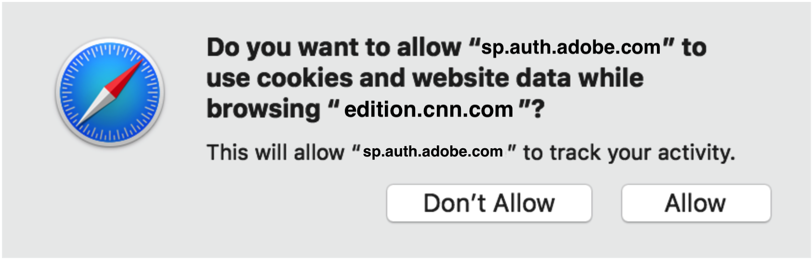

# Valutazione della prevenzione del tracciamento - Apple Safari {#tracking-prevention-assessment-apple-safari}

>[!NOTE]
>
>Il contenuto di questa pagina viene fornito solo a scopo informativo. L’utilizzo di questa API richiede una licenza corrente di Adobe. Non è consentito alcun uso non autorizzato.

## Safari 10 {#safari10}

**Dettagli**

A partire da Safari 10, le impostazioni predefinite della privacy del browser impediranno il funzionamento delle funzioni Single Sign-On (SSO), Single Logout (SLO) e autenticazione passiva. Il Single Sign-On (SSO) e l’autenticazione passiva non funzioneranno nemmeno in
la stessa sessione tra più schede o finestre del browser.

Queste modifiche influiscono sui processi di autenticazione di Adobe Pass e hanno un impatto su di essi
per le seguenti versioni di AccessEnabler JavaScript SDK: v2 (versioni 2.x), v3 (versioni 3.x), v4 (versioni 4.x).

### Mitigazione {#mitigation-safari10}

Per attenuare queste limitazioni, puoi chiedere all&#39;utente di modificare le impostazioni di privacy del browser Safari 10 e di utilizzare l&#39;opzione &quot;**Consenti sempre**&quot; per la voce &quot;**Cookie e dati del sito Web**&quot; nella scheda Privacy del browser da Preferenze, come illustrato nell&#39;immagine seguente.

## Safari 11 {#safari11}

**Dettagli**

>[!IMPORTANT]
>
>Tutte le informazioni di cui sopra riportate nella sezione Safari 10 sono ancora valide per Safari 11.

A partire da Safari 11, il browser introduce il meccanismo [Intelligent Tracking Prevention](https://webkit.org/blog/7675/intelligent-tracking-prevention/)(ITP), una tecnologia che utilizza l&#39;euristica per impedire il tracciamento tra siti diversi. Queste euristiche influiscono sul modo in cui i cookie di terze parti vengono memorizzati e riprodotti nelle chiamate di rete, il che significa che, a seconda dell’attivazione del meccanismo ITP, il browser Safari bloccherà i cookie di terze parti nella comunicazione del modello client-server.

Il servizio di autenticazione di Adobe Pass utilizza e si basa sui cookie come parte del processo di autenticazione **per funzionare**. In situazioni in cui il processo di autenticazione si svolge automaticamente (ad esempio, Passaggio temporaneo) o in implementazioni che utilizzano iFrame o la funzionalità &quot;senza aggiornamento&quot;, i cookie di Adobe sono considerati cookie di terze parti e bloccati per impostazione predefinita. Per tutti gli altri casi, Safari utilizza un algoritmo di apprendimento automatico che potrebbe contrassegnare tutti i cookie del servizio di autenticazione di accesso di Adobe come cookie di tracciamento, essendo quindi soggetti al blocco di ITP.

In conclusione, un utente del browser Safari 11 potrebbe non essere in grado di eseguire l’autenticazione su un sito web abilitato all’autenticazione di Adobe Pass dopo l’attivazione del meccanismo ITP (Intelligent Tracking Prevention), in particolare quando utilizza più siti web abilitati all’autenticazione di Adobe Pass. Di conseguenza, l’esperienza di autenticazione dell’utente potrebbe essere inaspettata e non definita, dall’impossibilità di accedere a una durata di autenticazione più breve del previsto.

Queste modifiche influiscono sui processi di autenticazione di Adobe Pass per le seguenti versioni dell’SDK di AccessEnabler JavaScript: v2 (versioni 2.x), v3 (versioni 3.x) e hanno un impatto su di essi.

### Mitigazione {#mitigation-safari11}

Sia per AccessEnabler JavaScript SDK v3 (versioni 3.x) che per AccessEnabler JavaScript SDK v4 (versioni 4.x), la libreria contiene un meccanismo in grado di identificare le situazioni in cui l’autenticazione dell’utente è stata bloccata a causa di cookie richiesti mancanti. In queste situazioni la libreria attiva un callback di errore specifico [N130](/help/authentication/error-reporting.md#advanced-error-codes-reference), che viene passato al sito Web abilitato per l&#39;autenticazione di Adobe Pass per essere utilizzato come segnale per istruire l&#39;utente ad eseguire azioni che possono attenuare il problema. Per beneficiare di questo meccanismo, il sito Web deve implementare la specifica [Segnalazione errori](/help/authentication/error-reporting.md).

Per AccessEnabler JavaScript SDK v2 (versioni 2.x), la libreria non offre il meccanismo descritto sopra, pertanto il sito web abilitato all’autenticazione di Adobe Pass non può essere segnalato quando istruire l’utente a intraprendere azioni per mitigare il problema.

L&#39;elenco delle azioni che possono attenuare i problemi sopra indicati **si applica a tutte e tre le versioni** dell&#39;SDK di AccessEnabler JavaScript.

Quando viene ricevuto il callback di errore [N130](/help/authentication/error-reporting.md#advanced-error-codes-reference) dal sito Web dell&#39;implementatore, l&#39;utente deve essere istruito a disabilitare Intelligent Tracking Prevention (ITP) e abilitare i cookie di terze parti:

* In caso di Mac OS X High Sierra e versioni successive: deselezionare l&#39;opzione &quot;**Impedisci il rilevamento intersito**&quot; per la voce &quot;**Tracciamento del sito Web**&quot; nella scheda Privacy del browser da Preferenze, come illustrato nell&#39;immagine seguente.

  

* In caso di Mac OS X Sierra e versioni precedenti: controllo dell&#39;opzione &quot;**Consenti sempre**&quot; per la voce &quot;**Cookie e dati del sito Web**&quot; nella scheda Privacy del browser da Preferenze, come illustrato nell&#39;immagine seguente.

  

## Safari 12 {#safari12}

**Dettagli**

>[!IMPORTANT]
>
>Tutte le informazioni di cui sopra relative alle sezioni Safari 10 e Safari 11 sono ancora applicabili nel caso di Safari 12.

Questa sezione descrive i problemi di compatibilità di **AccessEnabler JavaScript SDK versioni 4.x** in Safari 12.

>[!NOTE]
>
>Tieni presente che, in caso di AccessEnabler JavaScript SDK versioni 2.x e AccessEnabler JavaScript SDK versioni 3.x, entrambi utilizzano cookie di terze parti per i processi di autenticazione e, a causa dei criteri ITP e dei cookie di terze parti che iniziano con Safari 11, l’esperienza di autenticazione dell’utente potrebbe essere inaspettata e non definita, dall’impossibilità di accedere a una durata di autenticazione più breve del previsto.

### Funzionalità certificata di AccessEnabler JavaScript SDK v4 (versioni 4.x) su Safari 12 {#certified-functionality-of-accessenabler-javacscript=sdk-v4}

**I flussi di autenticazione** che utilizzano l&#39;interazione dell&#39;utente funzioneranno sempre, anche se nel browser dell&#39;utente i cookie di terze parti sono disabilitati, perché a partire dalla versione 4.0 l&#39;SDK di AccessEnabler JavaScript non utilizza più i cookie di terze parti per i processi di autenticazione.

>[!NOTE]
>
>L’utente DEVE interagire con il sito per aprire i popup di accesso e/o interagire con la pagina di accesso di MVPD.

**Le operazioni Autorizzazione/Verifica preliminare/Metadati utente** sono completamente funzionanti, a condizione che l&#39;utente sia già autenticato.

### Problemi noti di AccessEnabler JavaScript SDK v4 (versioni 4.x) su Safari 12 {#known-issues-of-accessenabler-javascript-sdk-4}

* SSO e SLO

   * A causa del modo in cui localStorage viene implementato in Safari a partire da Safari 10, l’SDK JS non può più condividere lo stato di accesso tramite un iFrame di dominio comune. Ciò significa che l’utente deve effettuare l’accesso a ogni sito che utilizza l’SDK di AccessEnabler JavaScript. La disconnessione inoltre non elimina i token di autenticazione tra siti, pertanto l’utente deve disconnettersi da ogni sito web abilitato all’autenticazione di Adobe Pass.

* Passaggio temporaneo

   * Per i passaggi temporanei, l’SDK di AccessEnabler JavaScript utilizza un meccanismo di individualizzazione per bloccare un token di autenticazione su un dispositivo specifico (istanza del browser). A causa dei nuovi meccanismi di Safari 12 progettati per impedire il tracciamento, l&#39;impronta digitale che stiamo calcolando e utilizzando nel meccanismo di individualizzazione **sarà la stessa per tutti gli utenti che hanno lo stesso indirizzo IP**. Prendiamo in considerazione l’IP del cliente a scopo di personalizzazione, ma anche in questo caso l’impatto è sugli utenti che condividono lo stesso indirizzo IP pubblico. Per questi utenti, calcoleremo lo stesso ID di individualizzazione e il passaggio temporaneo sarà associato a esso. Ciò significa che, una volta che tale utente utilizza un pass temporaneo, nessun altro potrà accedervi \! Questo interessa in particolare gli utenti aziendali, gli istituti di istruzione o qualsiasi altra organizzazione che ha più utenti che utilizzano NAT o un proxy comune per accedere a Internet.

>[!NOTE]
>
>Questo problema riguarda gli utenti solo se l&#39;implementatore utilizza Passaggio temporaneo come risultato dell&#39;interazione dell&#39;utente, altrimenti l&#39;autenticazione Passaggio temporaneo è soggetta a **Flussi automatici** di seguito.

* Flussi automatici

   * I flussi di autenticazione tentati in modalità automatizzata, senza alcuna interazione da parte dell’utente, non avranno esito positivo in Safari 12 quando si utilizza l’SDK JS 4.0. Il prossimo SDK JS 4.1 risolve tutti i problemi relativi ai flussi automatizzati.

Casi d’uso interessati da questo problema:

* Autenticazione automatica TempPass (anteprima gratuita): per tali flussi, l’SDK genera un errore N130.

* Autenticazione passiva (non riuscita): all’utente viene richiesto di selezionare questo MVPD e immettere le credenziali

### Mitigazione {#mitigation-safari12}

**SSO e SLO**

Al momento della stesura di queste note non è disponibile o possibile alcuna mitigazione nota. Apple ha introdotto un&#39;&quot;API di accesso all&#39;archiviazione&quot; in Safari 12 (`https://webkit.org/blog/8124/introducing-storage-access-api`), ma l&#39;implementazione corrente non si applica a localStorage ma solo ai cookie. Inoltre, per utilizzare l’API è necessaria l’interazione dell’utente e, una volta utilizzata, all’utente viene richiesta anche una finestra di dialogo per l’autorizzazione simile a quella riportata di seguito.

A questo punto questi requisiti/prompt di Safari non si allineano con i nostri requisiti UX e non abbiamo un comportamento coerente come su altri browser, dove SSO &quot;funziona solo&quot; una volta salvato un token in un dominio comune localStorage.

**Passaggio temporaneo**

Per mitigare i problemi di individualizzazione e consentire l&#39;interazione con l&#39;utente, si consiglia di utilizzare **[Promotional Temp Pass](/help/authentication/promotional-temp-pass.md)** in modo interattivo e di fornire almeno un&#39;informazione aggiuntiva sull&#39;utente (ad esempio, l&#39;indirizzo e-mail).

## Safari 13 {#safari13}

**Dettagli**

>[!IMPORTANT]
>
>Tutte le informazioni sopra riportate, dalla sezione Safari 10 alla sezione Safari 12, sono ancora valide nel caso di Safari 13.

A partire da Safari 13, il browser introduce nuove modifiche alla [Intelligent Tracking Prevention](https://webkit.org/blog/7675/intelligent-tracking-prevention/) (ITP), rendendo l&#39;euristica alla base del meccanismo più rigorosa nel processo di contrassegnare i cookie di terze parti come cookie di tracciamento, al fine di impedire il tracciamento tra siti diversi.

Come descritto nelle sezioni precedenti, il servizio di autenticazione di Adobe Pass utilizza e si basa su cookie di terze parti come parte dei processi di autenticazione quando gli implementatori utilizzano AccessEnabler JavaScript SDK v2 (versioni 2.x) e AccessEnabler JavaScript SDK v3 (versioni 3.x). Rispetto alle versioni precedenti del browser Safari, quando ITP interveniva dopo un po’ di tempo per &quot;apprendere&quot; l’interazione tra l’utente e le parti interessate (siti web e Adobe del programmatore), il browser Safari 13 blocca dall’inizio i cookie di terze parti che sono considerati cookie di tracciamento nella comunicazione modello client-server.

In conclusione, un utente del browser Safari 13 molto probabilmente non sarà in grado di avviare nuove autenticazioni su un sito Web abilitato all’autenticazione di Adobe Pass che utilizza una versione precedente di AccessEnabler JavaScript SDK, v2 (versioni 2.x) o v3 (versioni 3.x). Questo problema è dovuto al fatto che tutti i cookie del servizio di autenticazione Primetime di Adobe richiesti sono bloccati da ITP, il che rende il servizio non in grado di soddisfare la richiesta di autenticazione.

La libreria AccessEnabler JavaScript SDK v4 (versioni 4.x) non utilizza cookie di terze parti per il processo di autenticazione, pertanto le sue operazioni non sono influenzate in alcun modo dalle modifiche di Safari 13.

### Mitigazione {#mitigation-safari13}

In primo luogo, si consiglia vivamente di **eseguire la migrazione alle versioni 4.x** dell&#39;SDK JavaScript di AccessEnabler per ottenere un comportamento stabile e prevedibile nel browser Safari.

In secondo luogo, per AccessEnabler JavaScript SDK v3 (versioni 3.x), la libreria contiene un meccanismo in grado di identificare le situazioni in cui l’autenticazione degli utenti è stata bloccata a causa di cookie richiesti mancanti. In queste situazioni la libreria attiva un callback di errore specifico ([N130](/help/authentication/error-reporting.md#advanced-error-codes-reference)) che viene passato al sito Web abilitato per l&#39;autenticazione di Adobe Pass per essere utilizzato come segnale per istruire l&#39;utente ad eseguire azioni che possono attenuare il problema. Per beneficiare di questo meccanismo, il sito Web deve implementare la specifica [Segnalazione errori](/help/authentication/error-reporting.md).

Per AccessEnabler JavaScript SDK v2 (versioni 2.x), la libreria non offre il meccanismo descritto sopra, pertanto il sito web abilitato all’autenticazione di Adobe Pass non può essere segnalato quando istruire l’utente a intraprendere azioni per mitigare il problema.

Quando viene ricevuto il callback di errore [N130](/help/authentication/error-reporting.md#advanced-error-codes-reference) dal sito Web dell&#39;implementatore, l&#39;utente deve essere istruito a disabilitare Intelligent Tracking Prevention (ITP) e abilitare i cookie di terze parti:

* In caso di Mac OS X High Sierra e versioni successive: deselezionare l&#39;opzione &quot;**Impedisci il rilevamento intersito**&quot; per la voce &quot;**Tracciamento del sito Web**&quot; nella scheda Privacy del browser da Preferenze, come illustrato nell&#39;immagine seguente.

  

* In caso di Mac OS X Sierra e versioni precedenti: controllo di the opzione &quot;**Consenti sempre**&quot; per la voce &quot;**Cookie e dati del sito Web**&quot; nella scheda Privacy del browser da Preferenze, come illustrato nell&#39;immagine seguente.

  
