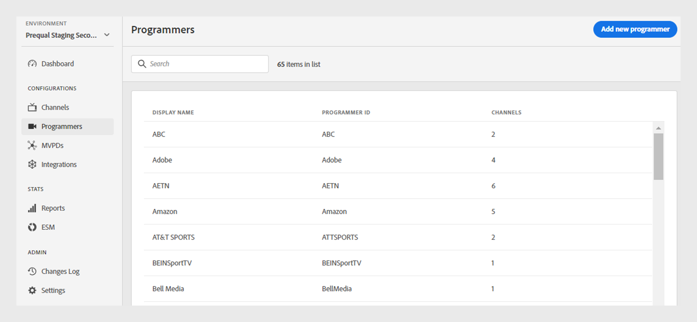

# Programmatori {#programmers}

>[!NOTE]
>
>Il contenuto di questa pagina viene fornito solo a scopo informativo. L’utilizzo di questa API richiede una licenza corrente di Adobe. Non è consentito alcun uso non autorizzato.

La sezione **Programmatori** della dashboard TVE consente di visualizzare e gestire le impostazioni per i [programmatori](/help/authentication/glossary.md#programmer) collegati alle adesioni del tuo account. Puoi anche [aggiungere un nuovo programmatore](#add-new-programmer) in base alle tue esigenze.

La scheda **Programmatori** nel pannello a sinistra visualizza un elenco di programmatori esistenti con i dettagli seguenti:

* **ID programmatore**: un identificatore di società di media all&#39;interno del sistema.
* **Canali**: numero di canali associati collegati a un programmatore.

*Elenco dei programmatori esistenti*

Digitare il nome del programmatore nella barra di **Ricerca** sopra l&#39;elenco per ulteriori informazioni su un programmatore.

## Gestione configurazioni programmatore {#manage-programmer-conf}

Segui questi passaggi per gestire varie impostazioni di un programmatore specifico.

1. Seleziona la scheda **Programmatori** nel pannello a sinistra.
1. Selezionare un programmatore dall&#39;elenco.
1. Selezionare una delle schede seguenti per visualizzare e modificare le impostazioni corrispondenti del programmatore selezionato:

   * [Canali](#channels)
   * [Certificati](#certificates)
   * [Applicazioni registrate](#registered-applications)
   * [Schemi personalizzati](#custom-schemes)

   

   *Impostazioni programmatore*

>[!IMPORTANT]
>
> Visualizza [Rivedi e invia modifiche](/help/authentication/tve-dashboard/new-tve-dashboard/tve-dashboard-review-push-changes.md) per ulteriori informazioni sull&#39;attivazione delle modifiche alla configurazione.

### Canali {#channels}

Questa scheda visualizza un elenco di canali collegati a un programmatore corrente. Seleziona un canale specifico da questo elenco per accedere alle informazioni dettagliate nella sezione [Canali](/help/authentication/tve-dashboard/new-tve-dashboard/tve-dashboard-channels.md).

Per aggiungere un nuovo canale per il programmatore selezionato, selezionare **Aggiungi nuovo canale** dall&#39;angolo superiore destro della sezione **Canali disponibili**. Scopri [come aggiungere un nuovo canale](/help/authentication/tve-dashboard/new-tve-dashboard/tve-dashboard-channels.md#add-new-channel).

*Aggiungi un nuovo canale*

### Certificati {#certificates}

In questa scheda viene visualizzato un elenco di [certificati disponibili](#available-certificates) utilizzati nei flussi di crittografia dei metadati utente. Vengono visualizzati i dettagli di ogni certificato, tra cui:

* Lo stato (se abilitato o meno per la crittografia dei metadati dell&#39;utente ****)
* Numero di serie
* Nome dell&#39;organizzazione emittente
* Nome dell&#39;organizzazione soggetto
* Data di emissione
* Data di scadenza
* Menu a discesa per crittografare i metadati utente (se si seleziona **Sì**, il certificato crittograferà le informazioni utente riservate, ad esempio i valori del codice postale).

#### Certificati disponibili {#available-certificates}

Questi certificati fungono da chiavi private o pubbliche e vengono utilizzati per la crittografia dei metadati utente. Tutti i canali associati alla stessa società di media possono utilizzare questi certificati.

È possibile apportare le seguenti modifiche ai certificati disponibili:

* [Aggiungi nuovo certificato](#add-new-certificate)
* [Elimina certificato](#delete-certificate)

##### Aggiungi nuovo certificato {#add-new-certificate}

Per aggiungere un nuovo certificato, segui la procedura riportata di seguito.

1. Seleziona **Aggiungi nuovo certificato** nell&#39;angolo superiore destro della sezione **Certificati disponibili**.

   

   *Aggiungi un nuovo certificato*

1. Incolla la chiave pubblica del certificato nella finestra di dialogo **Nuovo certificato**.

1. Seleziona **Aggiungi certificato**.

1. Individua il nuovo certificato nell&#39;elenco di **Certificati disponibili**.

   >[!IMPORTANT]
   >
   > Assicurati che i sistemi siano aggiornati e pronti per l’utilizzo del nuovo certificato.

1. Seleziona **Sì** da **Utilizzato per crittografare i metadati utente** menu a discesa per attivare un nuovo certificato.

È stata creata una nuova modifica alla configurazione ed è pronto per l’aggiornamento del server. Per utilizzare il nuovo certificato elencato nella sezione **Certificati disponibili**, procedere con il flusso [revisioni e modifiche push](/help/authentication/tve-dashboard/new-tve-dashboard/tve-dashboard-review-push-changes.md).

##### Elimina certificato {#delete-certificate}

Per eliminare un certificato, segui la procedura riportata di seguito.

1. Passa il puntatore del mouse sul certificato da eliminare dall&#39;elenco di **certificati disponibili**.

1. Selezionare **Rimuovi**.

   

   *Rimuovi il certificato selezionato*

1. Selezionare **Elimina** nella finestra di dialogo **Elimina certificato**.

È stata creata una nuova modifica alla configurazione ed è pronto per l’aggiornamento del server. Il certificato verrà eliminato dalla sezione **Certificati disponibili** solo dopo [modifiche di revisione e push](/help/authentication/tve-dashboard/new-tve-dashboard/tve-dashboard-review-push-changes.md).

### Applicazioni registrate {#registered-applications}

In questa scheda viene visualizzato un elenco delle applicazioni registrate. Per ulteriori dettagli sull&#39;utilizzo delle applicazioni registrate, consultare la documentazione [panoramica sulla registrazione dei client dinamici](../../dcr-api/dynamic-client-registration-overview.md).

Con le applicazioni registrate è possibile eseguire le azioni seguenti:

* [Aggiungere una nuova applicazione registrata](#add-registered-applications)
* [Scaricare un rendiconto software](#download-software-statement)

#### Aggiungi nuova applicazione registrata {#add-registered-applications}

Per aggiungere una nuova applicazione registrata, eseguire la procedura seguente.

1. Seleziona **Aggiungi nuova applicazione** nell&#39;angolo superiore destro della sezione **Applicazioni registrate**.

   

   *Aggiungi una nuova applicazione*

1. Selezionare **Assegnato al canale** dal menu a discesa nella finestra di dialogo **Nuova applicazione**.

   >[!IMPORTANT]
   >
   > Si consiglia di creare applicazioni registrate con autorizzazioni più specifiche e limitate per migliorare la sicurezza e impedire l’accesso non autorizzato. Pertanto, durante la creazione di applicazioni registrate, è consigliabile utilizzare opzioni più ristrette per l&#39;elemento `channel` assegnato.

1. Seleziona **Piattaforme** dal menu a discesa.

   >[!IMPORTANT]
   >
   > Si consiglia di creare applicazioni registrate con autorizzazioni più specifiche e limitate per migliorare la sicurezza e impedire l’accesso non autorizzato. Pertanto, durante la creazione di applicazioni registrate, è consigliabile utilizzare opzioni più ristrette per l&#39;elemento `platforms` assegnato.

1. Selezionare **Domini** dal menu a discesa.

   >[!IMPORTANT]
   >
   > Nel processo di registrazione del client, l’applicazione client può richiedere di essere autorizzata a utilizzare un URL di reindirizzamento per la finalizzazione del flusso di autenticazione. Quando un&#39;applicazione client utilizza un URL di reindirizzamento specifico, questo viene convalidato in base al `domains` scelto in questa selezione.

1. Digitare il **Nome** dell&#39;applicazione.

1. Digitare la **versione** dell&#39;applicazione.

   >[!IMPORTANT]
   >
   > Si consiglia di creare una nuova applicazione registrata per ogni aggiornamento principale dell&#39;applicazione client per gestirne il ciclo di vita e l&#39;utilizzo. Se necessario, crea un ticket tramite [Zendesk](https://adobeprimetime.zendesk.com) e chiedi al tuo Technical Account Manager (TAM) di revocare un&#39;applicazione registrata per bloccare la funzionalità di una versione specifica dell&#39;applicazione client.

1. Selezionare il valore **Type** &quot;DIRECT&quot; dal menu a discesa.

1. Selezionare **Aggiungi applicazione**.

È stata creata una nuova modifica alla configurazione ed è pronto per l’aggiornamento del server. Per utilizzare la nuova applicazione registrata elencata nella sezione **Applicazioni registrate**, procedere con il flusso [revisione e push modifiche](/help/authentication/tve-dashboard/new-tve-dashboard/tve-dashboard-review-push-changes.md).

#### Scarica informativa software {#download-software-statement}

Per scaricare un&#39;istruzione software, eseguire la procedura seguente.

1. Passare il puntatore del mouse sull&#39;applicazione registrata per scaricare l&#39;istruzione software dall&#39;elenco delle **applicazioni registrate**.

1. Seleziona **Scarica**.

   

   *Scarica un&#39;istruzione software*

### Schemi personalizzati {#custom-schemes}

In questa scheda viene visualizzato un elenco di schemi personalizzati. Per ulteriori dettagli relativi all&#39;utilizzo di schemi personalizzati, consulta la [registrazione dell&#39;applicazione iOS/tvOS](/help/authentication/iostvos-application-registration.md).

È possibile apportare le seguenti modifiche agli schemi personalizzati:

* [Genera un nuovo schema personalizzato](#generate-custom-schemes)

#### Genera nuovo schema personalizzato {#generate-custom-schemes}

Per generare un nuovo schema personalizzato, segui la procedura riportata di seguito.

1. Selezionare **Genera nuovo schema personalizzato**.

   

   *Genera un nuovo schema personalizzato*

È stata creata una nuova modifica alla configurazione ed è pronto per l’aggiornamento del server. Per utilizzare il nuovo schema personalizzato elencato nella sezione **Schemi personalizzati**, procedere con il flusso [revisione e push modifiche](/help/authentication/tve-dashboard/new-tve-dashboard/tve-dashboard-review-push-changes.md).

## Aggiungi nuovo programmatore {#add-new-programmer}

Per aggiungere una nuova entità programmatore, segui la procedura riportata di seguito.

1. Seleziona la scheda **Programmatori** nel pannello a sinistra.

1. Seleziona **Aggiungi nuovo programmatore** nell&#39;angolo superiore destro della sezione **Programmatori**.

   

   *Aggiungi un nuovo programmatore*

1. Digitare l&#39;identificatore della società di supporti in **ID programmatore** nella finestra di dialogo **Nuovo programmatore**.

1. Digitare il nome del marchio commerciale che si desidera visualizzare nella console in **Nome visualizzato**.

1. Seleziona **Aggiungi programmatore**.

È stata creata una nuova modifica alla configurazione ed è pronto per l’aggiornamento del server. Per utilizzare il nuovo programmatore elencato nella sezione **Programmer**, procedere con il flusso [revisione e push modifiche](/help/authentication/tve-dashboard/new-tve-dashboard/tve-dashboard-review-push-changes.md).
