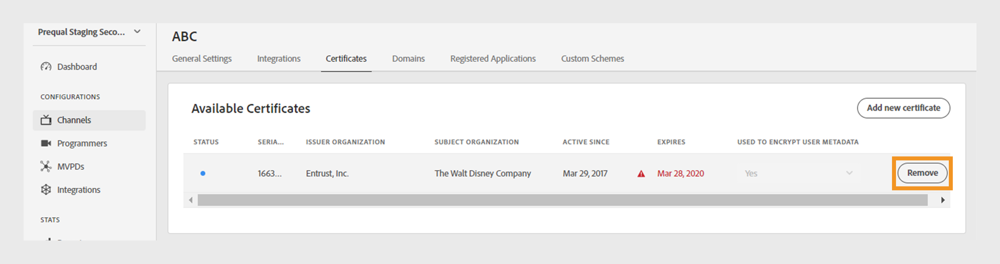
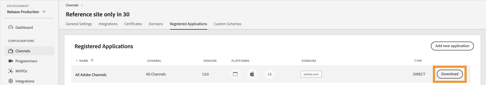

# Canali {#channels}

>[!NOTE]
>
>Il contenuto di questa pagina viene fornito solo a scopo informativo. L’utilizzo di questa API richiede una licenza corrente da Adobe. Non è consentito alcun uso non autorizzato.

La sezione **Canali** della dashboard TVE consente di visualizzare e gestire le impostazioni per i canali associati a un programmatore specifico. Puoi anche [aggiungere un nuovo canale](#add-new-channel) in base alle tue esigenze.

Nella scheda **Canali** nel pannello a sinistra viene visualizzato un elenco di canali collegati con i dettagli seguenti:

* **Nome visualizzato**: il nome del marchio del canale utilizzato a scopo commerciale.
* **ID canale**: un identificatore univoco, noto anche come ID richiedente.
* **Integrazioni**: numero di connessioni stabilite con [MVPDs](/help/authentication/integration-guide-programmers/rest-apis/rest-api-v2/rest-api-v2-glossary.md#mvpd).

*Elenco dei canali esistenti*

Digitare il nome del canale nella barra di **Ricerca** sopra l&#39;elenco per ulteriori informazioni sul canale.

## Gestire le configurazioni dei canali {#manage-channel-conf}

Segui i passaggi per gestire varie impostazioni di un canale specifico.

1. Seleziona la scheda **Canali** nel pannello a sinistra.

1. Seleziona il canale dall’elenco disponibile.

1. Selezionare una delle schede seguenti per visualizzare e modificare le impostazioni corrispondenti del canale selezionato:

   * [Impostazioni generali](#general-settings)
   * [Integrazioni](#integrations)
   * [Certificati](#certificates)
   * [Domini](#domains)
   * [Applicazioni registrate](#registered-applications)
   * [Schemi personalizzati](#custom-schemes)

   

   *Impostazioni canale*

>[!IMPORTANT]
>
> Visualizza [Rivedi e invia modifiche](/help/authentication/user-guide-tve-dashboard/tve-dashboard-review-push-changes.md) per ulteriori informazioni sull&#39;attivazione delle modifiche alla configurazione.

### Impostazioni generali {#general-settings}

Questa scheda presenta **Informazioni canale** e **Configurazione Analytics**.

#### Informazioni canale {#channel-information}

In questa sezione puoi modificare i seguenti dettagli:

* **Nome visualizzato**: il nome del marchio del canale utilizzato a scopo commerciale.

* **URL di reindirizzamento predefinito**: URL di reindirizzamento del backup per l&#39;autenticazione e la disconnessione.

* **Segnalazione errori**: quando selezioni **Sì**, gli SDK Adobe Pass inviano segnalazioni errori al backend Adobe Pass per Analytics.

*Modifica informazioni canale*

#### Configurazione di Analytics {#analytics-configuration}

Questa sezione ti consente di configurare l’inoltro di eventi di autenticazione Adobe Pass ad Adobe Analytics.

Per abilitare la **configurazione di Analytics**, contatta il tuo Technical Account Manager (TAM) per ulteriori dettagli sulla configurazione dell&#39;ID suite di rapporti (RSID).

*Abilita configurazioni Analytics*

Seleziona **Aggiungi nuova configurazione di analisi** per aggiungere più configurazioni.

È stata creata una nuova modifica alla configurazione ed è pronto per l’aggiornamento del server. Per utilizzare la nuova configurazione di Analytics dalla sezione **Configurazione di Analytics**, procedere con il flusso [Revisione e push modifiche](/help/authentication/user-guide-tve-dashboard/tve-dashboard-review-push-changes.md).

### Integrazioni {#integrations}

In questa scheda viene visualizzato un elenco delle integrazioni disponibili tra il canale attualmente selezionato e gli MVPD. L’elenco presenta ogni integrazione con il relativo stato, indicando se è abilitata o meno. Seleziona un&#39;integrazione specifica da questo elenco per accedere alle informazioni dettagliate nella sezione [Integrazioni](tve-dashboard-integrations.md).

*Elenco delle integrazioni disponibili*

### Certificati {#certificates}

In questa scheda viene visualizzato un elenco di [certificati disponibili](#available-certificates) e [certificati disponibili ereditati](#inherited-avail-certificates) utilizzati nei flussi di crittografia dei metadati utente. Vengono visualizzati i dettagli di ogni certificato, tra cui:

* Lo stato (se abilitato o meno per la crittografia dei metadati dell&#39;utente **&#x200B;**)
* Numero di serie
* Nome dell&#39;organizzazione emittente
* Nome dell&#39;organizzazione soggetto
* Data di emissione
* Data di scadenza
* Menu a discesa per crittografare i metadati utente (se si seleziona **Sì**, il certificato crittografa le informazioni utente riservate, ad esempio i valori del codice postale).

#### Certificati disponibili {#available-certificates}

Questi certificati fungono da chiavi private o pubbliche e vengono utilizzati per la crittografia dei metadati utente.
Puoi apportare le seguenti modifiche nella sezione certificati disponibili:

* [Aggiungi nuovo certificato](#add-new-certificate)
* [Elimina certificato](#delete-certificate)

##### Aggiungi nuovo certificato {#add-new-certificate}

Per aggiungere un nuovo certificato, effettua le seguenti operazioni:

1. Seleziona **Aggiungi nuovo certificato** nella parte superiore della sezione **Certificati disponibili**.

   

   *Aggiungi un nuovo certificato*

1. Incolla la chiave pubblica del certificato nella finestra di dialogo **Nuovo certificato**.

1. Seleziona **Aggiungi certificato**.

1. Individua il nuovo certificato nell&#39;elenco di **Certificati disponibili**.

   >[!IMPORTANT]
   >
   > Assicurati che i sistemi siano aggiornati e pronti per l’utilizzo del nuovo certificato.

1. Seleziona **Sì** da **Utilizzato per crittografare i metadati utente** menu a discesa per attivare un nuovo certificato.

È stata creata una nuova modifica alla configurazione ed è pronto per l’aggiornamento del server. Per utilizzare il nuovo certificato elencato nella sezione **Certificati disponibili**, procedere con il flusso [revisioni e modifiche push](/help/authentication/user-guide-tve-dashboard/tve-dashboard-review-push-changes.md).

##### Elimina certificato {#delete-certificate}

Per eliminare un certificato, segui la procedura riportata di seguito.

1. Passa il puntatore del mouse sul certificato da eliminare dall&#39;elenco di **certificati disponibili**.

1. Selezionare **Rimuovi**.

   

   *Rimuovi il certificato selezionato*

1. Selezionare **Elimina** dalla finestra di dialogo **Elimina certificato attivo**.

È stata creata una nuova modifica alla configurazione ed è pronto per l’aggiornamento del server. Il certificato verrà eliminato dalla sezione **Certificati disponibili** solo dopo [modifiche di revisione e push](/help/authentication/user-guide-tve-dashboard/tve-dashboard-review-push-changes.md).

#### Certificati disponibili ereditati {#inherited-avail-certificates}

Le società di media definiscono questi certificati al proprio livello. Tutti i canali associati alla stessa società di media possono utilizzare questi certificati.

*Certificati disponibili ereditati*

### Domini {#domains}

In questa scheda viene visualizzato un elenco dei domini disponibili attraverso i quali il rispettivo canale comunica con l’autenticazione di Adobe Pass.

Puoi apportare le seguenti modifiche ai domini:

* [Aggiungi un nuovo dominio](#add-domains)
* [Elimina dominio](#delete-domain)

>[!TIP]
>
> Evita di aggiungere un nuovo sottodominio se nell’elenco è presente un dominio più generale.

#### Aggiungi nuovo dominio {#add-domains}

Per aggiungere un dominio, segui la procedura riportata di seguito.

1. Selezionare **Aggiungi nuovo dominio** nell&#39;angolo superiore destro della sezione **Domini disponibili**.

   

   *Aggiungi un nuovo dominio*

1. Digitare il nome del dominio nella finestra di dialogo **Nuovo dominio**.

1. Selezionare **Aggiungi dominio** per aggiungere un nuovo dominio per il canale selezionato.

È stata creata una nuova modifica alla configurazione ed è pronto per l’aggiornamento del server. Per utilizzare il nuovo dominio elencato nella sezione **Domini disponibili**, procedere con il flusso [revisioni e modifiche push](/help/authentication/user-guide-tve-dashboard/tve-dashboard-review-push-changes.md).

#### Elimina dominio {#delete-domain}

Per eliminare un dominio, segui la procedura riportata di seguito.

1. Passare il puntatore del mouse sul dominio che si desidera eliminare dall&#39;elenco di **domini disponibili**.

1. Selezionare **Rimuovi**.

   

   *Rimuovi il dominio selezionato*

1. Selezionare **Elimina** nella finestra di dialogo **Elimina dominio**.

È stata creata una nuova modifica alla configurazione ed è pronto per l’aggiornamento del server. Il dominio verrà eliminato dalla sezione **Domini disponibili** solo dopo [modifiche di revisione e push](/help/authentication/user-guide-tve-dashboard/tve-dashboard-review-push-changes.md).

Il dominio selezionato non è più disponibile. Di conseguenza, l’applicazione associata a questo dominio perde l’accesso ai servizi di autenticazione di Adobe Pass.

### Applicazioni registrate {#registered-applications}

In questa scheda viene visualizzato un elenco delle applicazioni registrate. Per ulteriori dettagli sull&#39;utilizzo delle applicazioni registrate, consultare la documentazione [panoramica sulla registrazione dei client dinamici](../integration-guide-programmers/rest-apis/rest-api-dcr/dynamic-client-registration-overview.md).

Con le applicazioni registrate è possibile eseguire le azioni seguenti:

* [Aggiungere una nuova applicazione registrata](#add-registered-applications)
* [Scaricare un rendiconto software](#download-software-statement)

#### Aggiungi nuova applicazione registrata {#add-registered-applications}

Per aggiungere una nuova applicazione registrata, eseguire la procedura seguente.

1. Seleziona **Aggiungi nuova applicazione** nell&#39;angolo superiore destro della sezione **Applicazioni registrate**.

   

   *Aggiungi una nuova applicazione*

1. Selezionare **Piattaforme** dal menu a discesa nella finestra di dialogo **Nuova applicazione**.

   >[!IMPORTANT]
   >
   > Si consiglia di creare applicazioni registrate con autorizzazioni più specifiche e limitate per migliorare la sicurezza e impedire l’accesso non autorizzato. Pertanto, durante la creazione di applicazioni registrate, è consigliabile utilizzare opzioni più ristrette per l&#39;elemento `platforms` assegnato.

1. Selezionare **Domini** dal menu a discesa.

   >[!IMPORTANT]
   >
   > Nel processo di registrazione del client, l’applicazione client può richiedere di essere autorizzata a utilizzare un URL di reindirizzamento per la finalizzazione del flusso di autenticazione. Quando un&#39;applicazione client utilizza un URL di reindirizzamento specifico, questo viene convalidato in base al `domains` scelto in questa selezione.

1. Digitare il **Nome** dell&#39;applicazione.

1. Digitare la **versione** dell&#39;applicazione.

   >[!IMPORTANT]
   >
   > Si consiglia di creare una nuova applicazione registrata per ogni aggiornamento principale dell&#39;applicazione client per gestirne il ciclo di vita e l&#39;utilizzo. Se necessario, crea un ticket tramite [Zendesk](https://adobeprimetime.zendesk.com) e chiedi al tuo Technical Account Manager (TAM) di revocare un&#39;applicazione registrata per bloccare la funzionalità di una versione specifica dell&#39;applicazione client.

1. Selezionare il valore **Type** &quot;DIRECT&quot; dal menu a discesa.

1. Selezionare **Aggiungi applicazione**.

È stata creata una nuova modifica alla configurazione ed è pronto per l’aggiornamento del server. Per utilizzare la nuova applicazione registrata elencata nella sezione **Applicazioni registrate**, procedere con il flusso [revisione e push modifiche](/help/authentication/user-guide-tve-dashboard/tve-dashboard-review-push-changes.md).

#### Scarica informativa software {#download-software-statement}

Per scaricare un&#39;istruzione software, eseguire la procedura seguente.

1. Passare il puntatore sull&#39;applicazione registrata per scaricare l&#39;istruzione software dall&#39;elenco delle **applicazioni registrate**.

1. Seleziona **Scarica**.

   

   *Scarica un&#39;istruzione software*

### Schemi personalizzati {#custom-schemes}

In questa scheda viene visualizzato un elenco di schemi personalizzati. Per ulteriori dettagli relativi all&#39;utilizzo di schemi personalizzati, consulta la [registrazione dell&#39;applicazione iOS/tvOS](/help/authentication/integration-guide-programmers/legacy/sdks/ios-tvos-sdk/iostvos-application-registration.md).

È possibile apportare le seguenti modifiche agli schemi personalizzati:

* [Genera un nuovo schema personalizzato](#generate-custom-schemes)

#### Genera nuovo schema personalizzato {#generate-custom-schemes}

Per generare un nuovo schema personalizzato, segui la procedura riportata di seguito.

1. Selezionare **Genera nuovo schema personalizzato**.

   

   *Genera un nuovo schema personalizzato*

È stata creata una nuova modifica alla configurazione ed è pronto per l’aggiornamento del server. Per utilizzare il nuovo schema personalizzato elencato nella sezione **Schemi personalizzati**, procedere con il flusso [revisione e push modifiche](/help/authentication/user-guide-tve-dashboard/tve-dashboard-review-push-changes.md).

#### Schemi personalizzati ereditati {#inherited-custom-schemes}

Le società di media definiscono questi schemi personalizzati al proprio livello. Tutti i canali associati alla stessa media company possono utilizzare questi schemi personalizzati.

*Schemi personalizzati ereditati*

## Aggiungi nuovo canale {#add-new-channel}

Segui questi passaggi per aggiungere un nuovo canale.

1. Seleziona la scheda **Canali** nel pannello a sinistra.

1. Seleziona **Aggiungi nuovo canale** nell&#39;angolo superiore destro della sezione **Canali**.

   

   *Aggiungi un nuovo canale*

1. Selezionare **ID programmatore** dal menu a discesa nella finestra di dialogo **Nuovo canale**.

1. Digitare un identificatore univoco in **ID canale**.

1. Digitare il nome del marchio del canale utilizzato per scopi commerciali in **Nome visualizzato**.

1. Seleziona **Aggiungi canale**.

È stata creata una nuova modifica alla configurazione ed è pronto per l’aggiornamento del server. Per utilizzare il nuovo canale elencato nella sezione **Canali**, procedere con il flusso [revisione e modifiche push](/help/authentication/user-guide-tve-dashboard/tve-dashboard-review-push-changes.md).
