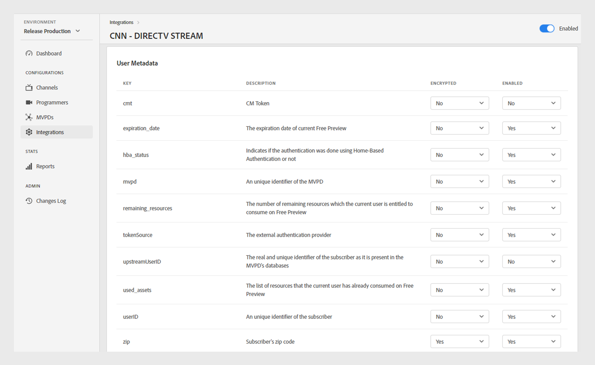
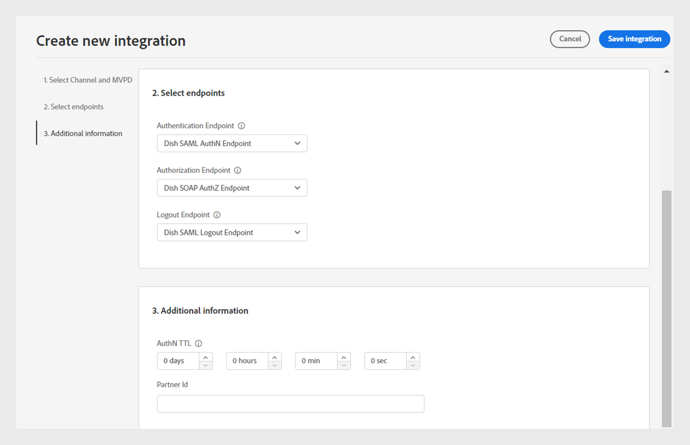

# Integrazioni

>[!NOTE]
>
>Il contenuto di questa pagina viene fornito solo a scopo informativo. L’utilizzo di questa API richiede una licenza corrente da Adobe. Non è consentito alcun uso non autorizzato.

La sezione **Integrazioni** della dashboard TVE consente di visualizzare e gestire le impostazioni per le integrazioni tra i canali e MVPD. Puoi anche [creare una nuova integrazione](#create-new-integration) in base alle tue esigenze.

La scheda **Integrazioni** nel pannello a sinistra visualizza un elenco delle integrazioni esistenti con i seguenti dettagli:

* Stato che indica se l’integrazione è attualmente attiva o inattiva
* Integrazione che collega canali specifici con i rispettivi MVPD
* Nome del canale con ID canale
* Nome visualizzato MVPD e ID MVPD

*Elenco integrazioni esistenti*

Digita il nome del canale o MVPD nella barra **Ricerca** sopra l&#39;elenco per ulteriori informazioni sull&#39;integrazione.

## Gestire le configurazioni di integrazione {#manage-integration-conf}

Per gestire un’integrazione specifica, segui la procedura riportata di seguito.

1. Seleziona la scheda **Integrazioni** nel pannello a sinistra.
1. Seleziona un’integrazione dall’elenco fornito per visualizzare e modificare le varie impostazioni nelle sezioni seguenti:

   * [Selezione endpoint](#endpoint-selection)
   * [Impostazioni piattaforma](#platform-settings)
   * [Metadati utente](#user-metadata)

>[!IMPORTANT]
>
> Visualizza [Rivedi e invia modifiche](/help/authentication/user-guide-tve-dashboard/tve-dashboard-review-push-changes.md) per ulteriori informazioni sull&#39;attivazione delle modifiche alla configurazione.

### Selezione endpoint {#endpoint-selection}

Questa sezione consente di scegliere gli endpoint del MVPD utilizzati per i flussi di autenticazione, autorizzazione e disconnessione dai rispettivi menu a discesa.

*Endpoint per flussi di autenticazione, autorizzazione e disconnessione*

>[!NOTE]
>
>Gli MVPD possono fornire uno o più endpoint per ciascun flusso. Quando si integra un nuovo canale, l’MVPD deve specificare il proprio endpoint preferito per ogni flusso.

>[!IMPORTANT]
>
>Qualsiasi modifica agli endpoint influisce sul comportamento complessivo di un’integrazione. Queste modifiche devono essere implementate solo dopo aver ricevuto conferma dall’MVPD.

### Impostazioni piattaforma {#platform-settings}

Questa sezione ti consente di visualizzare e modificare le impostazioni di integrazione in tutte le [piattaforme](/help/authentication/user-guide-tve-dashboard/tve-dashboard-reports.md#platforms). Puoi modificare queste impostazioni in base alle singole piattaforme. Ad esempio, puoi regolare la durata del TTL di autorizzazione in Android mantenendo un valore predefinito per un’altra piattaforma.

Ogni proprietà nelle impostazioni della piattaforma eredita un valore predefinito impostato da MVPD ma può essere regolato se necessario.

>[!IMPORTANT]
>
>È necessario un accordo con MVPD per determinare i valori impostati per ogni proprietà nelle impostazioni della piattaforma.

>[!IMPORTANT]
>
> L’ereditarietà delle impostazioni segue una catena che inizia dalle impostazioni MVPD (che sono le più generali), quindi dall’endpoint MVPD, dall’integrazione, dalla categoria di piattaforma e dalla piattaforma (che contiene il valore più specifico).

**Impostazioni piattaforma** viene utilizzato per sostituire le impostazioni per ogni livello nella catena di ereditarietà. I livelli disponibili nella catena sono raggruppati come segue:

* **Predefinito per tutti**: imposta i valori per le proprietà applicabili universalmente a tutte le piattaforme se non sono definiti valori di piattaforma specifici, indipendentemente dalle implementazioni del programmatore.

* **Dispositivi desktop**: imposta i valori per le proprietà applicabili a tutti i computer desktop e laptop, indipendentemente dal metodo di programmazione (SDK JS o API REST).

* **Dispositivi mobili**: imposta i valori per le proprietà applicabili a tutti i dispositivi mobili, inclusi **iOS**, **Android** e altri, indipendentemente dall&#39;approccio di programmazione (SDK o REST API).

* **Dispositivi connessi alla TV**: imposta i valori per le proprietà applicabili a tutti i dispositivi connessi alla TV, inclusi **tvOS**, **Roku**, **FireTV** e altri, indipendentemente dal metodo di programmazione (SDK o REST API).

* **Dispositivi non identificati**: imposta i valori per le proprietà applicabili a tutti i dispositivi in cui il meccanismo corrente non è in grado di identificare con precisione la piattaforma. In tali casi, applicare le norme più restrittive definite dalla MVPD.

  

  *Categoria di piattaforme e relativi dispositivi*

Seleziona Icona  situata a destra di ogni proprietà per esplorare le proprietà utilizzate per ogni livello di ereditarietà descritto in precedenza.

#### Flussi aziendali più utilizzati {#most-used-flows}

La sezione **Impostazioni piattaforma** offre una serie di proprietà utilizzate in diversi flussi di business. Le proprietà effettive possono variare a seconda degli MVPD selezionati nell’integrazione specifica. Di seguito sono riportati i flussi più utilizzati:

**TTL AuthN e TTL AuthZ in tutte le piattaforme**

>[!IMPORTANT]
>
>I valori TTL di autenticazione (AuthN) e TTL di autorizzazione (AuthZ) devono essere allineati in modo coerente con le impostazioni MVPD.

Per modificare il TTL di autenticazione e autorizzazione in tutte le piattaforme per un’integrazione specifica, segui la procedura riportata di seguito.

1. Seleziona la scheda **Integrazioni** nel pannello a sinistra.

1. Seleziona l’integrazione per la quale desideri modificare i valori AuthN TTL e AuthZ TTL.

1. Passare alla sezione **Impostazioni piattaforma**.

1. Seleziona **Predefinito per tutti** nella scheda **Impostazioni piattaforma**.

   >[!NOTE]
   >
   >Se si desidera modificare la durata di **AuthN TTL** e **AuthZ TTL** per una categoria di piattaforme o una piattaforma specifica, selezionare la piattaforma di conseguenza.

   

   *Modifica la durata TTL AuthN TTL AuthZ per tutte le piattaforme*

   **A.** proprietà TTL AuthN **B.** proprietà TTL AuthZ

1. Selezionare le frecce verso l&#39;alto e verso il basso per regolare la durata per il numero di giorni, ore, minuti e secondi nelle proprietà **AuthN TTL** e **AuthZ TTL**.

La durata per **AuthN TTL** e **AuthZ TTL** in tutte le piattaforme verrà aggiornata solo dopo [revisione e invio di modifiche](/help/authentication/user-guide-tve-dashboard/tve-dashboard-review-push-changes.md).

**Abilita SSO piattaforma**

>[!IMPORTANT]
>
>La proprietà **Abilita Single Sign On** è supportata esclusivamente su *piattaforme iOS, tvOS, Roku e FireTV*. Si applica solo alle integrazioni con MVPD che supportano il single sign-on per queste piattaforme.

Segui questi passaggi per abilitare o disabilitare l’SSO per un’integrazione e una piattaforma specifiche.

1. Seleziona la scheda **Integrazioni** nel pannello a sinistra.

1. Selezionare l&#39;integrazione per la quale si desidera attivare o disattivare l&#39;accesso Single Sign-On.

1. Passare alla sezione **Impostazioni piattaforma**.

1. Selezionare una piattaforma o una categoria specifica di piattaforme per cui si desidera abilitare l&#39;accesso Single Sign-On in **Impostazioni piattaforma**.

   

   *Abilita Single Sign-On per una piattaforma specifica*

   **A.** proprietà Single Sign On **B.** proprietà Enforce Platform Permissions

1. Selezionare **Sì** per abilitare o **No** per disabilitare dal menu a discesa **Abilita Single Sign On**.

1. Selezionare **Sì** per attivare o **No** per disattivare dal menu a discesa **Applica autorizzazione piattaforma**.

   **Applica autorizzazione piattaforma** controlla se la decisione dell&#39;utente di **Consentire** o **Negare** l&#39;accesso alla piattaforma alla sottoscrizione del provider TV viene rispettata.

   Ad esempio, se sia l&#39;opzione **Abilita Single Sign-On** che l&#39;opzione **Applica autorizzazione piattaforma** sono abilitate e l&#39;utente sceglie di negare l&#39;accesso alla piattaforma al proprio abbonamento al provider TV, la rispettiva applicazione (canale) non sarà in grado di utilizzare il token di autenticazione Adobe Pass ottenuto da un&#39;altra applicazione (canale).

La proprietà **Single Sign On** per una piattaforma selezionata verrà abilitata o disabilitata solo dopo [revisione e modifiche push](/help/authentication/user-guide-tve-dashboard/tve-dashboard-review-push-changes.md).

**Abilita autenticazione basata su Home**

Segui questi passaggi per abilitare o disabilitare l’autenticazione basata su home per gli MVPD basati su OAuth2.

1. Seleziona la scheda **Integrazioni** nel pannello a sinistra.

1. Seleziona l’integrazione per la quale desideri abilitare o disabilitare l’autenticazione basata sulla home.

1. Passare alla sezione **Impostazioni piattaforma**.

1. Selezionare una piattaforma o una categoria specifica di piattaforme per cui si desidera abilitare l&#39;autenticazione basata su home in **Impostazioni piattaforma**.

   

   *Abilitare l&#39;autenticazione basata su Home per una piattaforma specifica*

   **A.** Tentativo proprietà HBA **B.** proprietà TTL AuthN HBA

1. Selezionare **Sì** da abilitare e **No** da disabilitare dal menu a discesa **Tentativo HBA**.

>[!IMPORTANT]
>
>È necessario evitare di modificare la durata della proprietà **HBA AuthN TTL**. Potrebbero verificarsi errori imprevisti nel processo di autorizzazione.

La proprietà **Tentativo HBA** per un MVPD specifico verrà abilitata o disabilitata solo dopo [revisione e modifiche push](/help/authentication/user-guide-tve-dashboard/tve-dashboard-review-push-changes.md).

#### Aggiungi altre proprietà {#add-more-properties}

**Aggiungi altre proprietà** consente la flessibilità di includere proprietà specifiche aggiuntive per le integrazioni, in particolare per i flussi meno comuni.

Puoi aggiungere le seguenti proprietà:

* Per tutte le piattaforme, seleziona **Predefinito per tutte** le schede a sinistra.
* Per una categoria di piattaforma, selezionare la scheda **Dispositivi desktop**, **Dispositivi mobili** o **Dispositivi TV connessi** a sinistra.
* Per un dispositivo specifico, seleziona la scheda **iOS**, **Android**, **tvOS**, **Roku** o **FireTV** a sinistra.

Di seguito sono riportati alcuni esempi di flussi diversi che possono essere abilitati aggiungendo queste proprietà:

**Modifica il numero di risorse preautorizzate**

Per impostazione predefinita, la maggior parte degli MVPD supporta una chiamata authZ di verifica preliminare utilizzando fino a 5 ID di risorsa.
Tuttavia, nei casi in cui i MVPD accettano di aumentare questo limite, puoi passare a **Aggiungi altre proprietà** e selezionare **Verifica preliminare risorse massime** dal menu delle opzioni.

**Verifica preliminare max risorse** aggiungerà un nuovo attributo in cui è possibile specificare il limite concordato con MVPD.

*Aggiungi proprietà Max risorse verifica preliminare*

La proprietà **Verifica preliminare max risorse** verrà aggiunta solo dopo [modifiche di revisione e push](/help/authentication/user-guide-tve-dashboard/tve-dashboard-review-push-changes.md).

**Cambia il nome visualizzato MVPD o l&#39;URL del logo**

Per le applicazioni di programmazione che non desiderano creare il selettore MVPD e che invece si basano sulle configurazioni fornite, è possibile passare a **Aggiungi altre proprietà** e selezionare **Nome visualizzato** o **URL logo** per aggiungere il nome visualizzato o gli URL logo richiesti per ogni MVPD dal menu delle opzioni.

È possibile utilizzare valori diversi per queste proprietà per lo stesso MVPD a seconda della piattaforma del dispositivo e dell’esperienza utente desiderata.

*Aggiungi nome visualizzato o proprietà URL logo*

La proprietà **Nome visualizzato** o **URL logo** verrà aggiunta solo dopo [modifiche di revisione e push](/help/authentication/user-guide-tve-dashboard/tve-dashboard-review-push-changes.md).

**Richiedi un nuovo flusso di autenticazione al passaggio dell&#39;app (canale)**

Se desideri forzare una nuova autenticazione quando gli utenti passano da un’app all’altra. In tal caso, è possibile passare alla proprietà **Aggiungi altre proprietà** e selezionare la proprietà **Auth per Aggregator**.

L&#39;aggiunta di **Auth per Aggregator** interrompe effettivamente l&#39;accesso Single Sign-On per il rispettivo canale.

*Aggiungi proprietà Auth Per Aggregator*

La proprietà **Auth per Aggregator** verrà aggiunta solo dopo [modifiche di revisione e push](/help/authentication/user-guide-tve-dashboard/tve-dashboard-review-push-changes.md).

Dopo l&#39;aggiunta, selezionare **Sì** per abilitare la proprietà **Auth per Aggregator** per un&#39;integrazione selezionata.

#### Elimina proprietà {#delete-properties}

Seleziona Icona  situata a destra di ciascuna proprietà per eliminare le proprietà non più necessarie.

>[!NOTE]
>
>Alcune proprietà non possono essere rimosse in quanto sono requisiti obbligatori per l&#39;MVPD selezionato.

La proprietà verrà eliminata dalla sezione **Impostazioni piattaforma** solo dopo [modifiche di revisione e push](/help/authentication/user-guide-tve-dashboard/tve-dashboard-review-push-changes.md).

### Metadati utente {#user-metadata}

Questa sezione ti consente di aggiornare le impostazioni per ogni parametro di metadati utente condiviso da MVPD.

>[!NOTE]
>
>Ogni MVPD può condividere parametri diversi. Per ulteriori informazioni sui parametri che uno specifico MVPD può condividere, contatta il tuo rappresentante Adobe.

La sezione metadati utente visualizza le colonne seguenti:

**Chiave**: rappresenta i parametri metadati effettivi dell&#39;utente da utilizzare nell&#39;API per estrarre i valori.

**Descrizione**: fornisce una breve descrizione di ciascun parametro di metadati utente.

**Crittografato**: questa colonna consente di abilitare o disabilitare i parametri nell&#39;API selezionando **Sì** o **No** rispettivamente dal menu a discesa. Se si sceglie **Sì**, il valore del parametro verrà crittografato nell&#39;API. La crittografia viene eseguita utilizzando un certificato definito da un ambito **Metadati utente**.

>[!TIP]
>
>
> Verifica sempre che il parametro **ZIP** sia crittografato.

Ulteriori informazioni sui certificati disponibili nelle sezioni [Programmer](/help/authentication/user-guide-tve-dashboard/tve-dashboard-programmers.md#available-certificates) e [Canali](/help/authentication/user-guide-tve-dashboard/tve-dashboard-channels.md#available-certificates).

**Abilitato**: questa colonna consente di abilitare o disabilitare i parametri nell&#39;API selezionando rispettivamente **Sì** o **No** dal menu a discesa.

*Parametri disponibili per i metadati utente*

## Creare una nuova integrazione {#create-new-integration}

Per creare una nuova integrazione con un nuovo MVPD nella configurazione corrente, effettua le seguenti operazioni:

1. Seleziona la scheda **Integrazioni** nel pannello a sinistra.

1. Seleziona **Crea nuova integrazione** in alto a destra nella sezione **Integrazioni**.

   

   *Crea una nuova integrazione*

   Vengono visualizzate le seguenti sezioni:

   **Seleziona canale e MVPD**

   Seleziona un **Canale** dal menu a discesa **Seleziona canale** per aggiungere una nuova integrazione. Dopo aver selezionato il canale, seleziona il **MVPD** richiesto dal menu a discesa **Seleziona MVPD** da integrare con il canale selezionato.

   

   *Seleziona canale e MVPD*

   **Seleziona endpoint**

   Dopo aver selezionato l&#39;MVPD richiesto, la sezione **Seleziona endpoint** verrà precompilata con gli endpoint predefiniti configurati per quel particolare MVPD.

   >[!IMPORTANT]
   >
   >Non modificare gli endpoint predefiniti in alcun flusso a meno che non sia espressamente indicato dal MVPD.

   

   *Seleziona endpoint*

   **Ulteriori informazioni**

   Questa sezione include varie proprietà che devono essere configurate per l&#39;MVPD selezionato nella sezione **Seleziona canale e MVPD**.

   >[!NOTE]
   >
   > Le proprietà effettive possono variare a seconda degli MVPD selezionati nella sezione **Seleziona canale e MVPD**.

   Ad esempio, puoi modificare il **AuthN TTL** o **Partner ID** (Channel ID) a scopo di co-branding nella pagina di accesso di MVPD nell&#39;immagine seguente.

   

   *Modifica informazioni aggiuntive*

   Seleziona **Salva integrazione** in alto a destra nella sezione **Crea nuova integrazione**.

Una nuova integrazione verrà creata solo dopo [revisioni e modifiche push](/help/authentication/user-guide-tve-dashboard/tve-dashboard-review-push-changes.md).

## Disabilita integrazione {#disable-integration}

Per disabilitare un’integrazione, effettua le seguenti operazioni:

1. Seleziona la scheda **Integrazioni** nel pannello a sinistra.

1. Seleziona l’integrazione da disabilitare.

1. Disattiva l’opzione disponibile in alto a destra nell’integrazione selezionata.

   

   *Disabilita integrazione*

L&#39;integrazione verrà disabilitata solo dopo [modifiche di revisione e push](/help/authentication/user-guide-tve-dashboard/tve-dashboard-review-push-changes.md).

Una volta disattivata l&#39;integrazione, gli utenti finali perderanno la possibilità di eseguire l&#39;autenticazione o di autorizzare l&#39;utilizzo di MVPD specifico.
