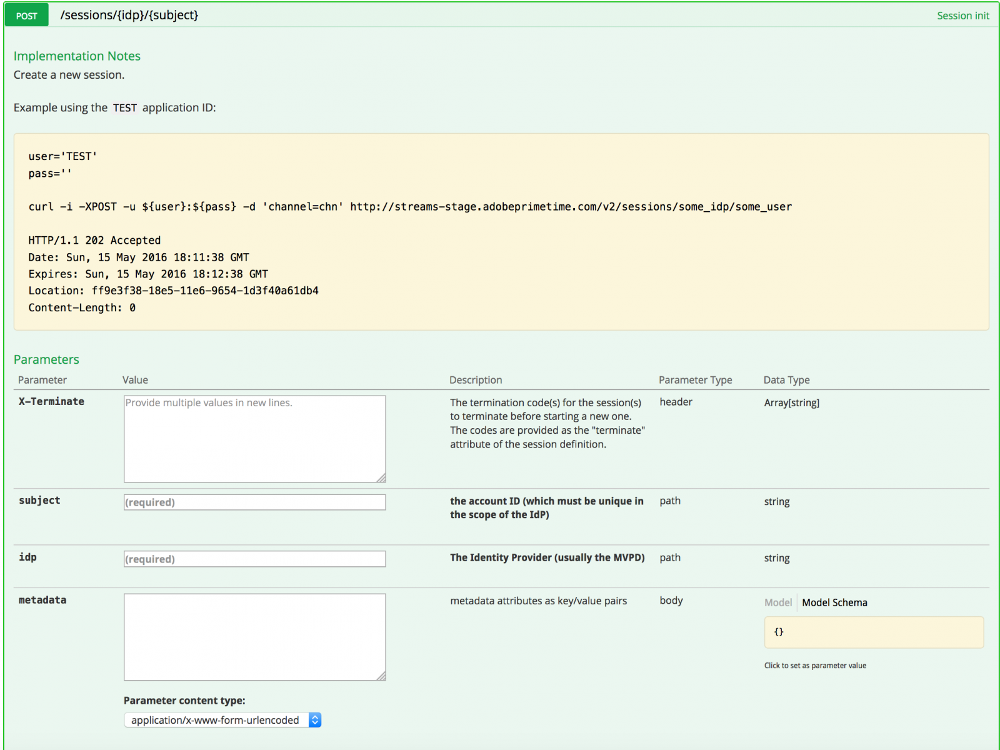
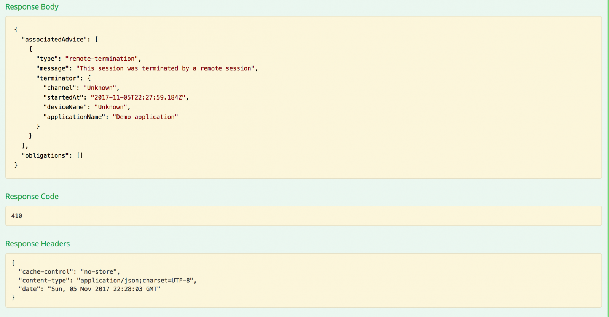
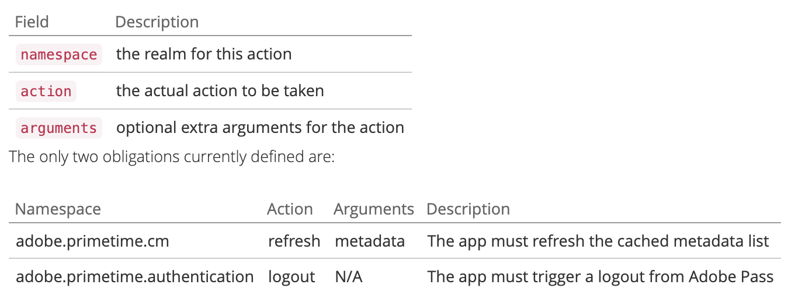

# Panoramica API {#api-overview}

Per ulteriori dettagli, consulta la [documentazione API online](http://docs.adobeptime.io/cm-api-v2/).

## Finalità e prerequisiti {#purpose-prerequisites}

Questo documento aiuta gli sviluppatori di applicazioni a utilizzare le nostre specifiche API Swagger durante l’implementazione di un’integrazione con il monitoraggio della concorrenza. Prima di seguire questa linea guida, si consiglia vivamente al lettore di avere una precedente comprensione dei concetti definiti dal servizio. Per ottenere questa comprensione, è necessario avere una panoramica della [documentazione del prodotto](/help/concurrency-monitoring/cm-home.md) e della [specifica API Swagger](http://docs.adobeptime.io/cm-api-v2/).


## Introduzione {#api-overview-intro}

Durante il processo di sviluppo, la documentazione pubblica di Swagger rappresenta la linea guida di riferimento per comprendere e testare i flussi API. Questo è un ottimo punto di partenza per avere un approccio pratico e familiarizzare con il modo in cui le applicazioni del mondo reale si comporterebbero in diversi scenari di interazione dell’utente.

Invia un ticket in [Zendesk](mailto:tve-support@adobe.com) per registrare la tua azienda e le tue applicazioni nel monitoraggio della concorrenza. Adobe assegnerà un ID applicazione a ogni entità. In questa guida utilizzeremo due applicazioni di riferimento con ID **demo-app** e **demo-app-2** che si troveranno nell&#39;Adobe tenant.


## Casi d’uso {#api-use-case}

Il primo passaggio nel testare un flusso utilizzando Swagger è quello di immettere l’ID dell’applicazione in alto a destra della pagina come segue:


In seguito, premi **Esplora** per impostare l&#39;ID che verrà utilizzato nell&#39;intestazione Autorizzazione per tutte le chiamate effettuate all&#39;API REST.  Ogni chiamata API prevede che l’ID applicazione venga trasmesso tramite l’autenticazione HTTP di base. Il nome utente è l&#39;ID applicazione e la password è vuota.


### Prima applicazione {#first-app-use-cases}

All&#39;applicazione con ID **demo-app** è stato assegnato da Adobe Team un criterio con una regola che limita a 3 il numero di flussi simultanei. Una polizza viene assegnata a una specifica applicazione in base alla richiesta presentata in Zendesk.


#### Recupero metadati {#retrieve-metadata-use-case}

La prima chiamata che effettuiamo è per la risorsa Metadati al fine di ottenere l’elenco degli attributi di metadati che devono essere trasmessi come dati del modulo durante l’inizializzazione della sessione. Questi metadati verranno utilizzati per valutare i criteri assegnati a questa applicazione.


Dopo aver premuto &quot;Try it out&quot; (Prova), per l&#39;applicazione con ID **demo-app** otterremo il seguente risultato:


Come è possibile vedere dal campo corpo della risposta, l’elenco degli attributi dei metadati è vuoto. Ciò significa che gli attributi richiesti dalla progettazione sono sufficienti per valutare il criterio dei 3 flussi assegnato a questa applicazione. Consulta anche la [documentazione sui campi di metadati standard](/help/concurrency-monitoring/standard-metadata-attributes.md). Dopo questa chiamata, possiamo continuare e creare una nuova sessione sulla risorsa REST Sessioni.


#### Inizializzazione della sessione {#session-initial}

La chiamata di inizializzazione della sessione viene eseguita da un’applicazione dopo l’acquisizione di tutte le informazioni necessarie per eseguirla.



Non è necessario fornire codice di terminazione alla prima chiamata perché non sono presenti altri flussi attivi. E nessun attributo di metadati perché non ne è stato restituito alcuno dalla chiamata di recupero dei metadati.

I parametri **subject** e **idp** sono obbligatori e verranno specificati come variabili di percorso URI. Puoi ottenere i parametri **subject** e **idp** effettuando una chiamata per i campi di metadati **mvpd** e **upstreamUserID** dall&#39;autenticazione di Adobe Pass. Vedi anche la [panoramica delle API dei metadati](https://experienceleague.adobe.com/docs/primetime/authentication/auth-features/user-metadat/user-metadata-feature.html?lang=en#). In questo esempio forniremo il valore &quot;12345&quot; come soggetto e &quot;adobe&quot; come idp.


Eseguire la chiamata di inizializzazione della sessione. Riceverai la seguente risposta:


Tutti i dati necessari sono contenuti nelle intestazioni di risposta. L&#39;intestazione **Location** rappresenta l&#39;ID della nuova sessione creata e le intestazioni **Date** e **Expires** rappresentano i valori utilizzati per pianificare l&#39;applicazione in modo che esegua l&#39;heartbeat successivo per mantenere attiva la sessione.

Con ogni chiamata è possibile inviare i metadati necessari, non solo quelli obbligatori per l’applicazione. L’invio di metadati può essere ottenuto in due modi:
* utilizzo di **query** **parametri**:

  ```sh
  curl -i -XPOST -u "user:pass" "https://streams-stage.adobeprimetime.com/v2/sessions/some_idp/some_user?metadata1=value1&metadata2=value2"
  ```

* utilizzo di **richiesta** **corpo**:

  ```sh
  curl -i -XPOST -u "user:pass" https://streams-stage.adobeprimetime.com/v2/sessions/some_idp/some_user -d "metadata1=value1" -d "metadata2=value2" -H "Content-Type=application/x-www-form-urlencoded"
  ```

#### Heartbeat {#heartbeat}

Effettuare una chiamata heartbeat. Fornisci l&#39;**ID sessione** ottenuto nella chiamata di inizializzazione della sessione, insieme ai parametri **subject** e **idp** utilizzati.


Per le chiamate heartbeat è consentito inviare metadati nello stesso modo in cui si esegue la sessione iniziale. È possibile aggiungere nuovi metadati in qualsiasi momento e aggiornare i valori inviati in precedenza con alcune **eccezioni**. I seguenti valori, una volta impostati, non possono essere modificati: **pacchetto**, **canale**, **piattaforma**, **assetId**, **idp**, **mvpd**, **hba_status**, **hba**,
**dispositivo mobile**

Se la sessione è ancora valida (non è scaduta o è stata eliminata manualmente), riceverai un risultato positivo:


Come nel primo caso, utilizzeremo le intestazioni **Data** e **Scade** per pianificare un altro heartbeat per questa particolare sessione. Se la sessione non è più valida, la chiamata avrà esito negativo con il codice di stato HTTP 410 GONE.

Puoi utilizzare l’opzione &quot;Keep the stream alive&quot; disponibile nell’interfaccia utente di Swagger per eseguire heartbeat automatici in una sessione specifica, questo può aiutarti a testare una regola senza doverti preoccupare della piattaforma standard necessaria per eseguire heartbeat di sessione puntuali. Questo pulsante è posizionato accanto al pulsante &quot;Prova&quot; nella scheda Swagger Heartbeat. Per impostare un heartbeat automatico per tutte le sessioni create, è necessario che siano programmate in un’interfaccia utente Swagger separata aperta in una scheda del browser web.


#### Terminazione sessione {#session-termination}

Il caso aziendale della tua azienda potrebbe richiedere il monitoraggio della concorrenza per terminare una sessione specifica quando, ad esempio, un utente smette di guardare un video. Per eseguire questa operazione, devi effettuare una chiamata DELETE sulla risorsa Sessioni.


Utilizza per la chiamata gli stessi parametri utilizzati per l’heartbeat di sessione. I codici di stato HTTP della risposta sono:

* 202 ACCETTATO per una risposta corretta
* 410 GONE se la sessione era già stata interrotta.

#### Ottieni tutti i flussi in esecuzione {#get-all-running-streams}

Questo endpoint offre tutte le sessioni attualmente in esecuzione per un tenant specifico in tutte le relative applicazioni. Utilizza i parametri **subject** e **idp** per la chiamata:


Quando effettui la chiamata riceverai la seguente risposta:


Per ogni sessione si otterrà il **terminationCode** e si completeranno i metadati.

Nota l&#39;intestazione **Scade**. Questo è il momento in cui la prima sessione deve scadere a meno che non venga inviato un heartbeat.
Nel campo metadati verranno inseriti tutti i metadati inviati all’avvio della sessione. Non lo filtriamo, riceverai tutto quello che hai inviato.
La risposta include tutti i flussi in esecuzione sulle app di altri tenant, purché le app condividano lo stesso criterio.
Se non sono presenti sessioni in esecuzione per un utente specifico quando effettui la chiamata, riceverai questa risposta:


Inoltre, in questo caso l&#39;intestazione **Scade** non è presente.

#### Interruzione del criterio {#breaking-policy-app-first}


Per simulare il comportamento della nostra applicazione quando il criterio dei 3 flussi ad essa assegnato è interrotto, è necessario effettuare 3 chiamate per l’inizializzazione della sessione. Affinché il criterio entri in vigore, le chiamate devono essere effettuate prima della scadenza di una sessione a causa della mancanza di heartbeat. Vedremo che tutte queste chiamate avranno esito positivo, ma se effettuiamo una quarta chiamata non riuscirà e verrà visualizzato il seguente errore:


Nel payload viene visualizzata una risposta 409 CONFLICT insieme a un oggetto risultato della valutazione. Ciò indica che i criteri lato server non consentono la creazione o la continuazione di questa sessione. Il corpo della risposta conterrà un oggetto EvaluationResult con AssociatedAdvice non vuoto, ovvero l&#39;elenco di oggetti Advice contenenti le spiegazioni per ogni violazione della regola.

L’applicazione deve richiedere all’utente i messaggi di errore riportati da ogni istanza di Advice. Inoltre, ogni consiglio indica anche i dettagli della regola come i nomi di attributi, soglie, regole e criteri. Inoltre, i valori in conflitto verranno inclusi anche nell’elenco delle sessioni attive per ciascun valore.

Queste informazioni sono destinate alla formattazione avanzata dei messaggi di errore e consentono all’utente di intervenire sulle sessioni in conflitto.

Ogni sessione in conflitto conterrà un **terminationCode** che può essere utilizzato per **uccidere** quel flusso. In questo modo, l’applicazione potrebbe consentire all’utente di scegliere le sessioni da terminare per tentare di accedere alla sessione corrente.

L’applicazione può utilizzare le informazioni del risultato della valutazione per visualizzare un determinato messaggio all’utente quando interrompe il video e per intraprendere ulteriori azioni, se necessario. Un caso d’uso può essere quello di interrompere altri flussi esistenti per avviarne uno nuovo. Questa operazione viene eseguita utilizzando il valore **terminationCode** presente nel campo **conflitti** per uno specifico attributo in conflitto. Il valore viene fornito come intestazione HTTP X-Terminate nella chiamata per una nuova inizializzazione di sessione.


Quando fornisci uno o più codici di terminazione all’inizializzazione della sessione, la chiamata avrà esito positivo e verrà generata una nuova sessione. Quindi, se proviamo a creare un heartbeat con una delle sessioni che sono state interrotte in remoto, otterremo una risposta 410 GONE con un payload dei risultati della valutazione che descrive il fatto che la sessione è stata terminata in remoto, come nell’esempio:



È possibile restituire 410 con o senza un corpo, in base alla causa dell&#39;interruzione della sessione corrente.

Quando la risposta non ha corpo, 410 significa che si tenta una chiamata heartbeat (o interruzione) per una sessione non più attiva (a causa di un timeout o di un conflitto precedente o di altro tipo). L’unico modo per ripristinare da questo stato è che l’applicazione avvii una nuova sessione. Poiché non è presente alcun corpo, l’applicazione deve gestire questo errore senza che l’utente ne sia a conoscenza.

D&#39;altra parte, quando viene fornito un corpo di risposta, l&#39;applicazione deve cercare nell&#39;attributo **associatedAdvice** per trovare un avviso di **terminazione remota** che indica la sessione remota avviata con l&#39;intenzione esplicita di **uccidere** quella corrente. Questo dovrebbe causare un messaggio di errore come &quot;La sessione è stata annullata da dispositivo/applicazione&quot;.

### Corpo risposta {#response-body}

Per tutte le chiamate API del ciclo di vita della sessione, il corpo della risposta (se presente) sarà un oggetto JSON contenente i campi seguenti:


**Avviso**
**EvaluationResult** includerà un array di oggetti Advice in **associatedAdvice**. Gli avvisi sono destinati all’applicazione per visualizzare un messaggio di errore completo per l’utente e (potenzialmente) consentire all’utente di intervenire.

Attualmente esistono due tipi di avvisi (specificati dal valore dell&#39;attributo **type**): **rule-law** e **remote-termination**. Il primo fornisce dettagli relativi a una regola interrotta e alle sessioni in conflitto con quella corrente (incluso l&#39;attributo terminate che può essere utilizzato per terminare tale sessione in remoto). La seconda afferma semplicemente che la sessione corrente è stata volutamente terminata da una sessione remota, in modo che gli utenti sapranno chi li ha cacciati quando sono stati raggiunti i limiti.


**Obbligo**
La valutazione può inoltre contenere una o più azioni predefinite che devono essere attivate dall’applicazione in seguito a tale valutazione.



### Seconda applicazione {#second-application}

L&#39;altra applicazione di esempio che utilizzeremo è quella con ID **demo-app-2**. A questo è stato assegnato un criterio con una regola che limita a un massimo di 2 il numero di flussi disponibili per un canale.   Devi fornire la variabile del canale per valutare questo criterio.

#### Recupero metadati {#retrieving-metadata}

Imposta il nuovo ID applicazione nell’angolo in alto a destra della pagina ed effettua una chiamata alla risorsa Metadati. Riceverai la seguente risposta:


Questa volta, il corpo della risposta non è più un elenco vuoto, come nell’esempio della prima applicazione. Ora il servizio di monitoraggio della concorrenza indica nel corpo della risposta che i metadati **channel** sono necessari all&#39;inizializzazione della sessione per valutare il criterio.

Se effettui una chiamata senza fornire un valore per il parametro **channel**, otterrai:

* Codice risposta - RICHIESTA 400 BAD
* Corpo di risposta: payload dei risultati di valutazione che descrive nel campo **requirements** ciò che è previsto nella richiesta di inizializzazione della sessione affinché l&#39;operazione venga completata correttamente.


#### Inizializzazione della sessione {#session-init}

Assegna un valore per la chiave di metadati richiesta e impostala come parametro di modulo nella richiesta di inizializzazione della sessione, come illustrato di seguito:


Ora la chiamata avrà esito positivo e verrà generata una nuova sessione.


#### Interruzione del criterio {#breaking-policy-second-app}

Per interrompere la regola presente nel criterio assegnato a questa applicazione, è necessario effettuare 2 chiamate con lo stesso valore di canale. Come nel primo esempio, la seconda chiamata deve essere eseguita mentre la prima sessione generata è ancora valida.


Se utilizziamo valori diversi per i metadati del canale ogni volta che creiamo una nuova sessione, tutte le chiamate avranno esito positivo perché la soglia di 2 ha come ambito ogni singolo valore.

Come nel primo esempio, possiamo utilizzare il codice di terminazione per interrompere in remoto i flussi in conflitto o possiamo aspettare che uno dei flussi scada, supponendo che non verrà operato alcun heartbeat su di essi.
